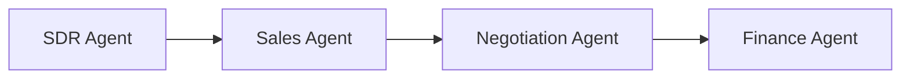

# Architect Mode Rules

## System Architecture

## Core Components

### Agent Pipeline
[`RevoOrchestrator`](app/orchestrator.py:34) coordinates sequential agent execution. Each agent processes entities by status and advances them through the pipeline.

### Database Layer
- **Models**: [`app/database/models.py`](app/database/models.py) - SQLAlchemy declarative models
- **Session Management**: Context manager pattern via `get_db_session()` in [`app/database/db.py`](app/database/db.py)
- **Data Access**: Functions in [`app/database/db_handler.py`](app/database/db_handler.py)

### LLM Integration
- **Client**: [`call_llm()`](app/services/llm_client.py:29) wraps Ollama API
- **Wrapper**: [`LLMClient`](app/llm/client.py:32) provides structured request/response with latency tracking
- **Prompts**: Templates in [`app/llm/prompt_templates/defaults.py`](app/llm/prompt_templates/defaults.py)

### API Layer
- **FastAPI app**: [`app/main.py`](app/main.py) creates ASGI application
- **Routes**: [`app/api/v1/endpoints.py`](app/api/v1/endpoints.py) for REST endpoints
- **Auth**: JWT-based with RBAC in [`app/auth/`](app/auth/)

### Task Queue
- **Celery**: [`app/tasks/celery_app.py`](app/tasks/celery_app.py) - has mock fallback when Celery not installed
- **Tasks**: [`app/tasks/agent_tasks.py`](app/tasks/agent_tasks.py) for async agent execution

## Entity Lifecycle

| Entity | Status Flow |
|--------|-------------|
| Lead | New → Contacted → Qualified/Disqualified |
| Deal | Qualified → Proposal Sent → Won/Lost |
| Contract | Negotiating → Signed → Completed/Cancelled |
| Invoice | Sent → Paid/Overdue |

## Key Architectural Constraints

### Status Enums Use Title Case
All status enums in [`app/core/enums.py`](app/core/enums.py) use title case values (e.g., `"New"`, `"Contacted"`, `"Qualified"`), NOT lowercase. This matches database values and UI usage.

### Review Gate Semantics
[`save_draft()`](app/database/db_handler.py:94) does NOT modify lead progression status. Only [`mark_review_decision()`](app/database/db_handler.py) can move leads to Contacted status. This enforces human-in-the-loop for email approvals.

### Database Fallback Behavior
When `DB_CONNECTIVITY_REQUIRED=false` (default in development), the system automatically falls back to SQLite if PostgreSQL is unavailable. See [`_fallback_to_sqlite_if_optional()`](app/database/db.py:103).

### Tenant Isolation
All entities have `tenant_id` with default=1. Unique constraints are tenant-scoped (e.g., `uq_leads_tenant_email`). See [`app/database/models.py`](app/database/models.py).

### LLM Failure Handling
[`call_llm()`](app/services/llm_client.py:29) returns empty string `""` on failure. All callers must handle this with fallback logic. Local Ollama connection errors fail-fast without retries.

### Celery Fallback Mode
When Celery is not installed, a mock implementation in [`app/tasks/celery_app.py`](app/tasks/celery_app.py) runs tasks synchronously. Set `CELERY_TASK_ALWAYS_EAGER=true` for local synchronous execution.

### SDR Negative Gate
[`check_negative_gate()`](app/agents/sdr_agent.py:45) filters leads before processing:
- Rejects leads with "layoff" or "competitor" in negative_signals
- Blocks forbidden sectors: government, academic, education, non-profit, ngo
- Skips leads contacted within 30 days

### SDR Signal Scoring
[`calculate_signal_score()`](app/agents/sdr_agent.py:75) scores leads:
- Growth signals (hiring/growing/expanding): +30
- Tech change signals (tech/install/stack/migration): +25
- Decision maker role (cto/ceo/vp/head/director/founder/ciso): +20
- ICP fit (1000/500/enterprise/mid-market company size): +15
- Urgency (budget/q4/immediate): +10
