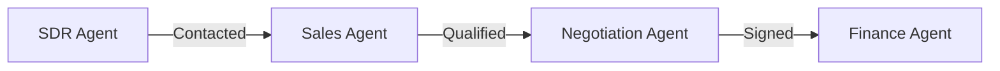

# AGENTS.md

This file provides guidance to agents when working with code in this repository.

## Build/Test Commands
```bash
# Run all tests
pytest -q

# Run specific test groups (as used in CI)
pytest -q tests/unit tests/test_db_handler.py tests/test_orchestrator.py tests/test_orm_utils.py tests/test_validators.py
pytest -q tests/integration tests/test_pipeline_integration_scaffold.py
pytest -q tests/test_phase2_services.py tests/test_phase2_api.py

# Run single test file
pytest -q tests/unit/services/test_lead_service.py

# Lint (syntax check only)
python -m compileall app tests

# Database migrations
alembic upgrade head
alembic downgrade base
```

## Critical Project Patterns

### Enum Values Use Title Case
All status enums in [`app/core/enums.py`](app/core/enums.py) use title case values (e.g., `"New"`, `"Contacted"`, `"Qualified"`), NOT lowercase. This matches database values and UI usage.

### Database Session Pattern
Use `get_db_session()` context manager from [`app/database/db.py`](app/database/db.py):
```python
from app.database.db import get_db_session
with get_db_session() as session:
    # queries here
```
Services can extend [`BaseService`](app/services/base_service.py) which provides context manager support.

### LLM Client
Use [`call_llm()`](app/services/llm_client.py:29) from `app/services/llm_client.py`. It connects to Ollama with model configured via `OLLAMA_MODEL` env var (default: `qwen2.5:7b`).

**Important**: `call_llm()` returns empty string `""` on failure. Always check for truthy response before parsing:
```python
response = call_llm(prompt, json_mode=True)
if response:
    data = json.loads(response)
else:
    # Use fallback logic
```

### Email Validation
[`validate_structure()`](app/utils/validators.py:39) in `app/utils/validators.py` enforces:
- Must start with "hi ", "hello ", or "dear "
- Must end with sign-off ("best,", "regards,", etc.) or email address
- Minimum 30 words
- No placeholder tokens from `FORBIDDEN_TOKENS` list

### Agent Pipeline Flow
SDR → Sales → Negotiation → Finance (see [`RevoOrchestrator`](app/orchestrator.py:34))



### Agent Thresholds

| Agent | Threshold | Value | Purpose |
|-------|-----------|-------|---------|
| SDR | `REVIEW_QUEUE_THRESHOLD` | 85 | Minimum score to enter review queue |
| SDR | `AUTO_SEND_THRESHOLD` | 92 | Score for immediate send (not implemented) |
| SDR | `SIGNAL_THRESHOLD` | 60 | Minimum signal score to proceed |
| Negotiation | `NEGOTIATION_APPROVAL_THRESHOLD` | 85 | Confidence threshold for approval |
| Negotiation | `MAX_NEGOTIATION_TURNS` | 3 | Maximum negotiation rounds |
| Finance | `DUNNING_APPROVAL_THRESHOLD` | 85 | Confidence threshold for dunning approval |

### SDR Negative Gate Checks
[`check_negative_gate()`](app/agents/sdr_agent.py:45) filters leads before processing:
- Rejects leads with "layoff" or "competitor" in negative_signals
- Blocks forbidden sectors: government, academic, education, non-profit, ngo
- Skips leads contacted within 30 days

### SDR Signal Scoring
[`calculate_signal_score()`](app/agents/sdr_agent.py:75) scores leads:
- Growth signals (hiring/growing/expanding): +30
- Tech change signals (tech/install/stack/migration): +25
- Decision maker role (cto/ceo/vp/head/director/founder/ciso): +20
- ICP fit (1000/500/enterprise/mid-market company size): +15
- Urgency (budget/q4/immediate): +10

### Review Gate Semantics
[`save_draft()`](app/database/db_handler.py:94) does NOT modify lead progression status. Only [`mark_review_decision()`](app/database/db_handler.py) can move leads to Contacted status.

### Database Fallback Behavior
When `DB_CONNECTIVITY_REQUIRED=false` (default in development), the system automatically falls back to SQLite if PostgreSQL is unavailable. See [`_fallback_to_sqlite_if_optional()`](app/database/db.py:103).

### Test Database Isolation
Tests use `isolated_session_factory` fixture in [`tests/conftest.py`](tests/conftest.py) which creates isolated SQLite databases per test in `.test_tmp/` directory.

### Safe JSON Parsing
Use [`safe_parse_json()`](app/core/schemas.py:55) for LLM responses:
```python
from app.core.schemas import safe_parse_json
data = safe_parse_json(llm_response, default={"score": 0})
```

### Celery Fallback Mode
When Celery is not installed, a mock implementation runs tasks synchronously. Set `CELERY_TASK_ALWAYS_EAGER=true` for local synchronous execution. See [`app/tasks/celery_app.py`](app/tasks/celery_app.py).

### Tenant Isolation
All entities have `tenant_id` with default=1. Unique constraints are tenant-scoped (e.g., `uq_leads_tenant_email`). See [`app/database/models.py`](app/database/models.py).

## ⚠️ Non-Obvious Gotchas

### Dual Model System — NEVER Import from `app.models`
The project has two ORM model packages with **different Base classes**:
- **`app/database/models.py`** — Active system, used by all agents, db_handler, API, and Alembic. Import models HERE.
- **`app/models/`** — Planned refactor using modern `mapped_column` style. **NOT wired into Alembic or runtime code.**

Importing `Lead` from `app.models.lead` gives a different class than `Lead` from `app.database.models` — queries will fail silently.

### Dual Enum System — NEVER Import from `app.models.enums`
- **`app/core/enums.py`** — Active, plain `Enum`. Used everywhere.
- **`app/models/enums.py`** — Inactive, `str, Enum` subclass with extra values (`Void`, `RunStatus`, `UserRole`).

### `ReviewStatus` Breaks Title Case Convention
[`ReviewStatus`](app/core/enums.py:72) has three ALL_CAPS values: `"STRUCTURAL_FAILED"`, `"BLOCKED"`, `"SKIPPED"` — unlike all other enums which use title case.

### `get_db_session()` Does NOT Auto-Commit
You must call `session.commit()` explicitly within the `with` block. The context manager only closes the session in `finally`.

### Two Different Forbidden Token Lists
- [`FORBIDDEN_TOKENS`](app/utils/validators.py:8) — 8 tokens (used by `validate_structure()`)
- [`FORBIDDEN_PLACEHOLDER_TOKENS`](app/core/schemas.py:14) — 5 tokens (used by Pydantic schemas)

Emails can pass Pydantic validation but fail `validate_structure()` for tokens like `"[your position]"`.

### API Imports Must Use Compat Layer
API modules import from [`app/api/_compat.py`](app/api/_compat.py), NOT directly from `fastapi`. This provides mock fallbacks when FastAPI isn't installed.

### `sys.path.insert` is Legacy — Do NOT Add to New Files
Eight legacy files use `sys.path.insert(0, PROJECT_ROOT)`. New modules should NOT replicate this — `pythonpath = .` in `pytest.ini` handles imports.

### `DB_CONNECTIVITY_REQUIRED` Default Varies by Environment
Defaults to `True` when `ENV=production`, `False` otherwise. Not a simple false default.

### Test Isolation Only Covers `db_handler`
The `isolated_session_factory` fixture patches `get_db_session` on the `db_handler` module only. Code importing `get_db_session` from `app.database.db` directly or using `BaseService(db=None)` will use the **real database** in tests.

### Auth Bypass in Script Mode
[`get_current_user(token=None)`](app/core/dependencies.py:38) returns admin context (user_id=1, tenant_id=1, role=admin). Unauthenticated API paths run as admin unless explicitly blocked.

### SDR Profile is Hardcoded
[`config/sdr_profile.py`](config/sdr_profile.py) contains `SDR_NAME = "Aryan Jain"`, `SDR_COMPANY = "RevoAI"`, etc. Not env-var configurable.

### No Linter/Formatter Configured
No ruff, pylint, mypy, or black. Only `python -m compileall` for syntax checking. Follow existing code style manually.

### Structured Logging Convention
Log calls use `logger.info("event.name", extra={"event": "event.name", ...})` with dotted event names. The `extra["event"]` field is the canonical filter key.

### Hand-Rolled JWT
[`app/auth/jwt.py`](app/auth/jwt.py) implements HS256 JWT from scratch using `hmac` + `hashlib`. No PyJWT dependency.

### Docker vs CI PostgreSQL Mismatch
`docker-compose.yml` uses `postgres:14`, CI uses `postgres:16`. Keep migrations compatible with both.
