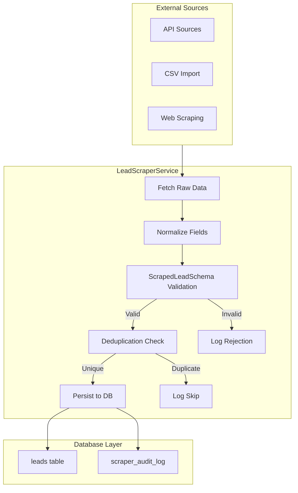
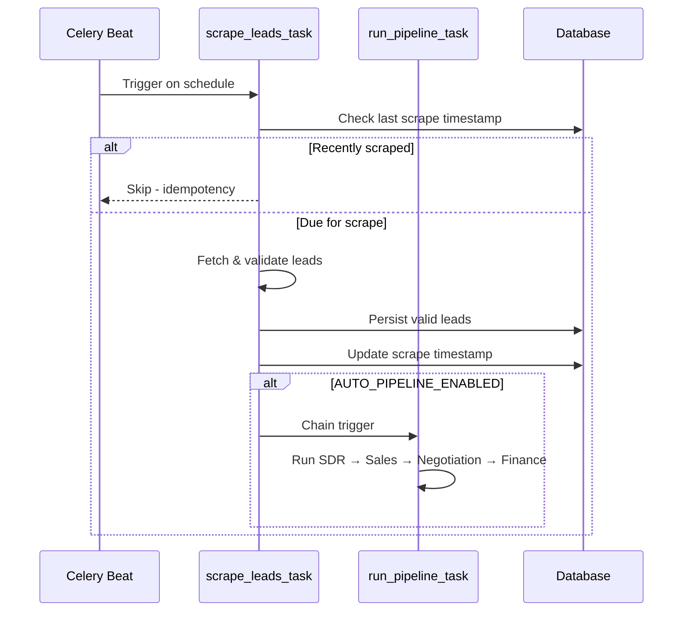
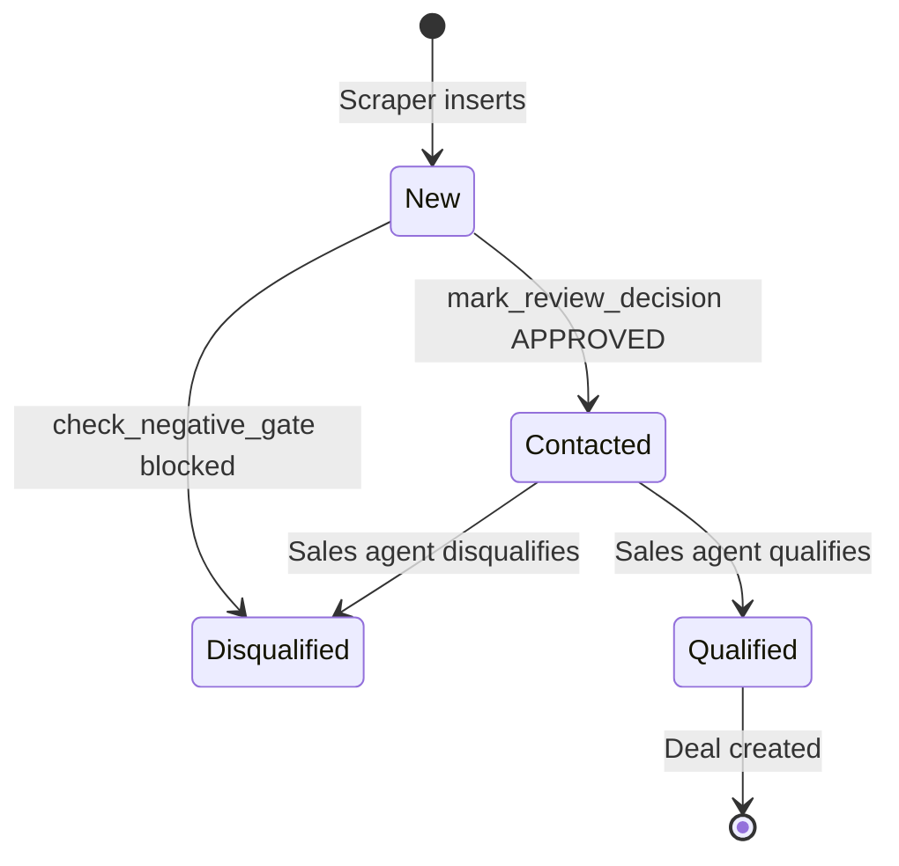
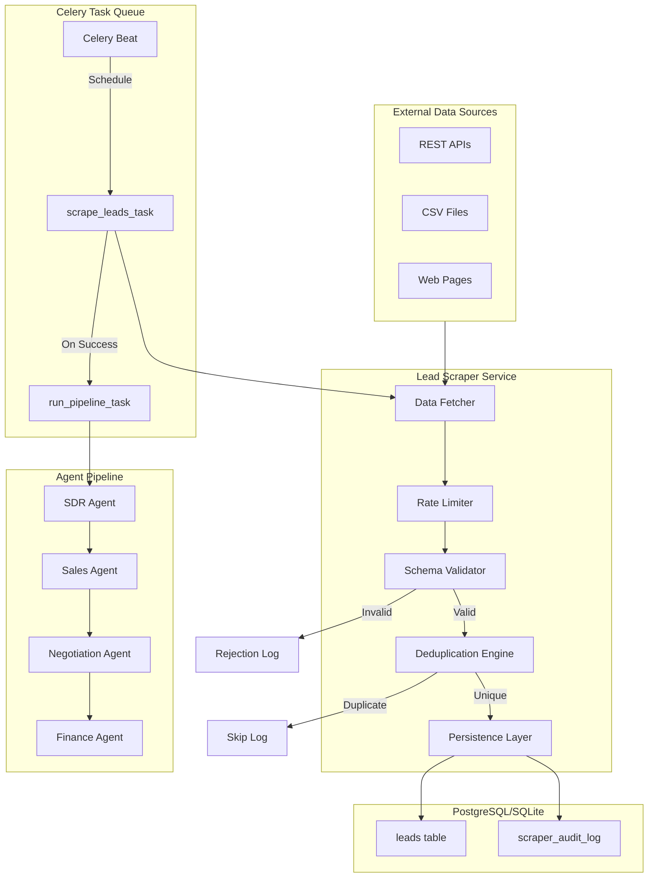

# Lead Scraper & Scheduler Production Hardening Plan

**Document Version:** 1.0  
**Created:** 2026-02-22  
**Status:** Draft for Review

---

## PHASE 1 — GAP ANALYSIS REPORT

### 1.1 Lead Model Analysis

The [`Lead`](app/database/models.py:24) model defines the following fields:

| Field | Type | Nullable | Default | Notes |
|-------|------|----------|---------|-------|
| `id` | Integer | No | Auto | Primary key |
| `tenant_id` | Integer | No | 1 | FK to tenants, indexed |
| `name` | String | No | - | Contact name |
| `email` | String | No | - | Unique per tenant |
| `role` | String | Yes | - | Job title |
| `company` | String | Yes | - | Company name |
| `website` | String | Yes | - | Company website |
| `location` | String | Yes | - | Geographic location |
| `company_size` | String | Yes | - | Employee count range |
| `industry` | String | Yes | - | Industry sector |
| `verified_insight` | Text | Yes | - | Research notes |
| `negative_signals` | Text | Yes | - | Comma-separated signals |
| `status` | String | Yes | "New" | Lead status |
| `last_contacted` | DateTime | Yes | - | Last outreach date |
| `signal_score` | Integer | Yes | - | Computed score |
| `confidence_score` | Integer | Yes | - | Email quality score |
| `review_status` | String | Yes | "New" | Review state |
| `draft_message` | Text | Yes | - | Generated email |
| `source` | String | Yes | "manual" | Lead origin |
| `created_at` | DateTime | Yes | utcnow | Timestamp |

**Key Constraints:**
- `uq_leads_tenant_email`: UniqueConstraint on (tenant_id, email)
- `idx_leads_status`: Index on status
- `idx_leads_review_status`: Index on review_status

### 1.2 SDR Agent Consumer Expectations

The [`check_negative_gate()`](app/agents/sdr_agent.py:45) function expects:
- `negative_signals`: Text field containing comma-separated keywords
- `industry`: String field for sector classification
- `last_contacted`: DateTime for recency check

The [`calculate_signal_score()`](app/agents/sdr_agent.py:75) function expects:
- `verified_insight`: Text field with research notes
- `role`: String field for decision-maker detection
- `company_size`: String field for ICP matching

**Critical Finding:** The SDR agent does NOT expect `positive_signals` as a separate field. It derives signals from `verified_insight` text analysis.

### 1.3 Current Scraper Implementation Gaps

#### [`lead_scraper.py`](app/services/lead_scraper.py) Issues:

| Issue | Severity | Description |
|-------|----------|-------------|
| **Missing Field Validation** | HIGH | No Pydantic schema enforcement |
| **No Domain Alignment Check** | HIGH | Email domain vs company_domain not validated |
| **No Generic Email Rejection** | HIGH | Accepts gmail.com, yahoo.com emails |
| **CSV-Only Persistence** | MEDIUM | Writes to CSV, not database directly |
| **No positive_signals Field** | LOW | Not required by SDR agent |
| **Fallback Data Generation** | MEDIUM | Uses random/fallback data generation |

#### [`LeadAcquisitionService`](app/services/lead_acquisition_service.py) Issues:

| Issue | Severity | Description |
|-------|----------|-------------|
| **Synthetic Data Generation** | CRITICAL | `_fallback_leads()` generates fake leads with random domains |
| **Missing Fields** | HIGH | No `role`, `company_size`, `verified_insight` population |
| **No Domain Validation** | HIGH | Accepts any email format |
| **No Tenant-Scoped Dedup** | MEDIUM | Checks email globally, not per-tenant |
| **No Signal Extraction** | MEDIUM | Does not populate negative_signals |

### 1.4 Scheduler Integration Gaps

#### [`scheduler.py`](app/tasks/scheduler.py) Issues:

| Issue | Severity | Description |
|-------|----------|-------------|
| **No Separate Scrape Task** | MEDIUM | Scraping embedded in pipeline task |
| **No Celery Beat Config** | MEDIUM | No beat schedule defined |
| **Missing Config Variable** | LOW | No `AUTO_LEAD_SCRAPE_INTERVAL_HOURS` |

### 1.5 Validation Deficiencies Summary

```
┌─────────────────────────────────────────────────────────────────────────────┐
│                        CURRENT VALIDATION GAP MATRIX                         │
├────────────────────────────┬────────────────┬───────────────────────────────┤
│ Validation Type            │ Current State  │ Required State                │
├────────────────────────────┼────────────────┼───────────────────────────────┤
│ Required Field Enforcement │ Partial        │ Strict Pydantic validation    │
│ Email Format Validation    │ Basic regex    │ Full RFC 5322 + domain check  │
│ Domain Alignment           │ MISSING        │ Email domain = company_domain │
│ Generic Email Rejection    │ MISSING        │ Block gmail.com, yahoo.com    │
│ Tenant-Scoped Uniqueness   │ DB constraint  │ Pre-insert check required     │
│ Negative Signals Parsing   │ MISSING        │ Extract from source data      │
│ Verified Insight Population│ MISSING        │ Extract from source data      │
│ Role/Title Normalization   │ MISSING        │ Standardize job titles        │
└────────────────────────────┴────────────────┴───────────────────────────────┘
```

---

## PHASE 2 — STRICT LEAD DATA CONTRACT

### 2.1 ScrapedLeadSchema Design

```python
# app/schemas/scraper.py

from pydantic import BaseModel, Field, field_validator, model_validator
from typing import Optional
from datetime import datetime
import re

# Generic email providers to reject
GENERIC_EMAIL_DOMAINS = frozenset({
    "gmail.com", "yahoo.com", "hotmail.com", "outlook.com", 
    "aol.com", "icloud.com", "mail.com", "protonmail.com",
    "yandex.com", "zoho.com", "gmx.com"
})

# Whitelist for specific exceptions (e.g., solo founders)
WHITELISTED_GENERIC_EMAILS = frozenset({
    # Add specific whitelisted emails here
})

EMAIL_PATTERN = re.compile(r"^[a-zA-Z0-9._%+-]+@[a-zA-Z0-9.-]+\.[a-zA-Z]{2,}$")
DOMAIN_PATTERN = re.compile(r"^[a-zA-Z0-9.-]+\.[a-zA-Z]{2,}$")


class ScrapedLeadSchema(BaseModel):
    """Strict schema for scraped lead data with zero tolerance for incomplete fields."""
    
    # Required fields - all must be populated
    tenant_id: int = Field(default=1, ge=1)
    company_name: str = Field(..., min_length=2, max_length=255)
    company_domain: str = Field(..., min_length=3, max_length=255)
    contact_name: str = Field(..., min_length=2, max_length=255)
    email: str = Field(..., min_length=5, max_length=320)
    job_title: str = Field(..., min_length=2, max_length=255)
    industry: str = Field(..., min_length=2, max_length=120)
    website: str = Field(..., min_length=5, max_length=255)
    source: str = Field(..., min_length=2, max_length=100)
    scraped_at: datetime = Field(default_factory=datetime.utcnow)
    
    # Signal fields - explicit lists, empty if none
    negative_signals: list[str] = Field(default_factory=list)
    positive_signals: list[str] = Field(default_factory=list)
    
    # Optional fields
    company_size: Optional[str] = Field(None, max_length=50)
    location: Optional[str] = Field(None, max_length=120)
    linkedin_url: Optional[str] = Field(None, max_length=500)
    verified_insight: Optional[str] = Field(None, max_length=2000)
    
    @field_validator("email")
    @classmethod
    def validate_email_format(cls, v: str) -> str:
        v = v.lower().strip()
        if not EMAIL_PATTERN.match(v):
            raise ValueError(f"Invalid email format: {v}")
        return v
    
    @field_validator("company_domain")
    @classmethod
    def validate_domain_format(cls, v: str) -> str:
        v = v.lower().strip()
        if not DOMAIN_PATTERN.match(v):
            raise ValueError(f"Invalid domain format: {v}")
        return v
    
    @field_validator("website")
    @classmethod
    def normalize_website(cls, v: str) -> str:
        v = v.lower().strip()
        if not v.startswith(("http://", "https://")):
            v = f"https://{v}"
        return v
    
    @model_validator(mode="after")
    def validate_domain_alignment(self) -> "ScrapedLeadSchema":
        """Ensure email domain matches company domain."""
        email_domain = self.email.split("@")[1]
        
        # Check for generic email providers
        if email_domain in GENERIC_EMAIL_DOMAINS:
            if self.email.lower() not in WHITELISTED_GENERIC_EMAILS:
                raise ValueError(
                    f"Generic email provider rejected: {email_domain}. "
                    f"Corporate email required."
                )
        
        # Check domain alignment (with subdomain tolerance)
        company_root = self._extract_root_domain(self.company_domain)
        email_root = self._extract_root_domain(email_domain)
        
        if company_root != email_root:
            # Allow if email is a corporate subdomain
            if not email_domain.endswith(f".{self.company_domain}"):
                if self.email.lower() not in WHITELISTED_GENERIC_EMAILS:
                    raise ValueError(
                        f"Domain mismatch: email domain '{email_domain}' "
                        f"does not match company domain '{self.company_domain}'"
                    )
        
        return self
    
    @staticmethod
    def _extract_root_domain(domain: str) -> str:
        """Extract root domain (e.g., 'example.com' from 'mail.example.com')."""
        parts = domain.split(".")
        if len(parts) >= 2:
            return ".".join(parts[-2:])
        return domain
    
    class Config:
        extra = "forbid"  # Reject unknown fields
        str_strip_whitespace = True
```

### 2.2 Schema-to-Model Mapping

```python
# Mapping from ScrapedLeadSchema to Lead model fields

FIELD_MAPPING = {
    "tenant_id": "tenant_id",
    "contact_name": "name",
    "email": "email",
    "job_title": "role",
    "company_name": "company",
    "website": "website",
    "location": "location",
    "company_size": "company_size",
    "industry": "industry",
    "verified_insight": "verified_insight",
    "source": "source",
}

def schema_to_model(schema: ScrapedLeadSchema) -> dict:
    """Convert validated schema to Lead model kwargs."""
    return {
        "tenant_id": schema.tenant_id,
        "name": schema.contact_name,
        "email": schema.email,
        "role": schema.job_title,
        "company": schema.company_name,
        "website": schema.website,
        "location": schema.location or "",
        "company_size": schema.company_size or "",
        "industry": schema.industry,
        "verified_insight": schema.verified_insight or "",
        "negative_signals": ",".join(schema.negative_signals) if schema.negative_signals else "",
        "status": "New",
        "review_status": "New",
        "source": schema.source,
    }
```

---

## PHASE 3 — SCRAPER SERVICE REDESIGN

### 3.1 Architecture Overview



### 3.2 LeadScraperService Design

```python
# app/services/lead_scraper_service.py

class LeadScraperService:
    """Production-hardened lead scraper with strict validation."""
    
    def __init__(self, tenant_id: int = 1):
        self.tenant_id = tenant_id
        self.metrics = ScraperMetrics()
        self.rate_limiter = RateLimiter()
    
    def scrape(self, sources: list[dict] | None = None) -> ScraperResult:
        """
        Main entry point for scraping.
        
        Returns:
            ScraperResult with counts and rejection details
        """
        pass
    
    def validate_lead(self, raw_data: dict) -> ScrapedLeadSchema | None:
        """Validate raw data against schema. Returns None on failure."""
        pass
    
    def check_duplicate(self, email: str) -> bool:
        """Check if email already exists for tenant."""
        pass
    
    def persist_lead(self, schema: ScrapedLeadSchema) -> Lead | None:
        """Atomically persist validated lead."""
        pass
    
    def log_rejection(self, raw_data: dict, reason: str) -> None:
        """Log rejected lead with structured JSON."""
        pass
```

### 3.3 Rejection Logging Format

```json
{
  "event": "scraper.lead.rejected",
  "timestamp": "2026-02-22T04:44:00Z",
  "tenant_id": 1,
  "rejection_reason": "domain_mismatch",
  "rejection_detail": "Email domain 'gmail.com' does not match company domain 'acme.com'",
  "raw_data_hash": "sha256:abc123...",
  "fields_present": ["name", "email", "company"],
  "fields_missing": ["job_title", "industry"]
}
```

---

## PHASE 4 — SCHEDULER INTEGRATION

### 4.1 Celery Beat Configuration

```python
# app/tasks/celery_app.py additions

CELERYBEAT_SCHEDULE = {
    "scrape-leads-hourly": {
        "task": "tasks.scrape_leads_task",
        "schedule": crontab(minute=0),  # Every hour
        "options": {"queue": "scraper"},
    },
    "run-pipeline-6h": {
        "task": "tasks.run_pipeline_task",
        "schedule": crontab(minute=0, hour="*/6"),  # Every 6 hours
        "options": {"queue": "pipeline"},
    },
}
```

### 4.2 Task Definitions

```python
# app/tasks/scheduler.py additions

@celery_app.task(name="tasks.scrape_leads_task", bind=True)
def scrape_leads_task(self, tenant_id: int | None = None) -> dict:
    """
    Scrape leads from configured sources.
    
    Idempotency: Checks last scrape timestamp before proceeding.
    """
    pass

@celery_app.task(name="tasks.run_pipeline_task", bind=True)
def run_pipeline_task(self, tenant_id: int | None = None) -> dict:
    """
    Run the SDR → Sales → Negotiation → Finance pipeline.
    
    Triggered after successful scrape if AUTO_PIPELINE_ENABLED.
    """
    pass
```

### 4.3 Task Chaining Logic



---

## PHASE 5 — PIPELINE ALIGNMENT

### 5.1 Lead Status Flow



### 5.2 SDR Agent Integration Points

| Integration Point | Location | Requirement |
|-------------------|----------|-------------|
| Lead Fetch | [`fetch_leads_by_status("New")`](app/database/db_handler.py:53) | Scraper must set status="New" |
| Negative Gate | [`check_negative_gate()`](app/agents/sdr_agent.py:45) | Requires negative_signals field |
| Signal Scoring | [`calculate_signal_score()`](app/agents/sdr_agent.py:75) | Requires verified_insight, role, company_size |
| Review Gate | [`save_draft()`](app/database/db_handler.py:94) | Must NOT modify status |
| Status Transition | [`mark_review_decision()`](app/database/db_handler.py:129) | Only path to Contacted |

---

## PHASE 6 — SAFETY & HARDENING

### 6.1 Observability

```python
# Prometheus metrics

LEADS_SCRAPED_TOTAL = Counter(
    "leads_scraped_total",
    "Total leads scraped from all sources",
    ["tenant_id", "source"]
)

LEADS_VALID_TOTAL = Counter(
    "leads_valid_total",
    "Total leads that passed validation",
    ["tenant_id"]
)

LEADS_REJECTED_TOTAL = Counter(
    "leads_rejected_total",
    "Total leads rejected during validation",
    ["tenant_id", "rejection_reason"]
)

SCRAPER_DURATION_SECONDS = Histogram(
    "scraper_duration_seconds",
    "Time spent scraping",
    ["tenant_id", "source"]
)
```

### 6.2 Rate Limiting

```python
# Rate limiter configuration

RATE_LIMITS = {
    "default": {
        "requests_per_second": 2,
        "burst": 5,
    },
    "ycombinator.com": {
        "requests_per_second": 0.5,
        "burst": 2,
    },
}
```

### 6.3 Error Handling

```python
class ScraperError(Exception):
    """Base exception for scraper errors."""
    pass

class SourceUnavailableError(ScraperError):
    """External source is unavailable."""
    pass

class ValidationError(ScraperError):
    """Lead validation failed."""
    pass

class DuplicateLeadError(ScraperError):
    """Lead already exists."""
    pass

class RateLimitExceededError(ScraperError):
    """Rate limit exceeded for source."""
    pass
```

---

## PHASE 7 — TESTING SUITE

### 7.1 Test Categories

| Category | File | Tests |
|----------|------|-------|
| Schema Validation | `tests/unit/schemas/test_scraper_schema.py` | Field validation, domain alignment |
| Email Logic | `tests/unit/services/test_lead_scraper.py` | Generic rejection, domain mismatch |
| Deduplication | `tests/unit/services/test_lead_scraper.py` | DB duplicate check |
| Scheduler Flow | `tests/unit/tasks/test_scheduler.py` | Task chaining, idempotency |
| Isolation | `tests/integration/test_multi_tenant.py` | Tenant data isolation |
| Idempotency | `tests/integration/test_scraper_idempotency.py` | Re-run produces same state |

### 7.2 Key Test Cases

```python
# tests/unit/schemas/test_scraper_schema.py

def test_reject_generic_email():
    """Gmail addresses should be rejected."""
    with pytest.raises(ValidationError, match="Generic email provider"):
        ScrapedLeadSchema(
            company_name="Acme Corp",
            company_domain="acme.com",
            contact_name="John Doe",
            email="john@gmail.com",  # Should fail
            job_title="CEO",
            industry="Technology",
            website="https://acme.com",
            source="test",
        )

def test_reject_domain_mismatch():
    """Email domain must match company domain."""
    with pytest.raises(ValidationError, match="Domain mismatch"):
        ScrapedLeadSchema(
            company_name="Acme Corp",
            company_domain="acme.com",
            contact_name="John Doe",
            email="john@competitor.com",  # Different domain
            job_title="CEO",
            industry="Technology",
            website="https://acme.com",
            source="test",
        )

def test_accept_subdomain_email():
    """Corporate subdomain emails should be accepted."""
    lead = ScrapedLeadSchema(
        company_name="Acme Corp",
        company_domain="acme.com",
        contact_name="John Doe",
        email="john@mail.acme.com",  # Subdomain OK
        job_title="CEO",
        industry="Technology",
        website="https://acme.com",
        source="test",
    )
    assert lead.email == "john@mail.acme.com"
```

---

## IMPLEMENTATION CHECKLIST

### Phase 1: Schema Implementation
- [ ] Create `app/schemas/scraper.py` with `ScrapedLeadSchema`
- [ ] Add `GENERIC_EMAIL_DOMAINS` constant
- [ ] Add `WHITELISTED_GENERIC_EMAILS` constant
- [ ] Implement domain alignment validator
- [ ] Add unit tests for schema validation

### Phase 2: Scraper Service
- [ ] Create `app/services/lead_scraper_service.py`
- [ ] Implement `LeadScraperService` class
- [ ] Add `validate_lead()` method
- [ ] Add `check_duplicate()` method with tenant scoping
- [ ] Add `persist_lead()` method with atomic transaction
- [ ] Add `log_rejection()` method with structured logging
- [ ] Add rate limiting integration
- [ ] Add Prometheus metrics

### Phase 3: Scheduler Integration
- [ ] Add `AUTO_LEAD_SCRAPE_INTERVAL_HOURS` config
- [ ] Create `scrape_leads_task` Celery task
- [ ] Create `run_pipeline_task` Celery task
- [ ] Add Celery Beat schedule configuration
- [ ] Implement task chaining logic
- [ ] Add idempotency checks

### Phase 4: Configuration
- [ ] Add scraper config to `app/core/config.py`
- [ ] Add environment variable documentation
- [ ] Update `.env.example`

### Phase 5: Testing
- [ ] Create `tests/unit/schemas/test_scraper_schema.py`
- [ ] Create `tests/unit/services/test_lead_scraper_service.py`
- [ ] Create `tests/unit/tasks/test_scheduler.py`
- [ ] Create `tests/integration/test_scraper_pipeline.py`
- [ ] Add test fixtures for sample data

### Phase 6: Documentation
- [ ] Update AGENTS.md with scraper patterns
- [ ] Add API documentation for scraper endpoints
- [ ] Add runbook for scraper operations

---

## ARCHITECTURE DIAGRAM



---

## CRITICAL RULES ENFORCEMENT

| Rule | Enforcement Point |
|------|-------------------|
| No Hallucinations | Schema validation rejects missing required fields |
| No Nulls | Pydantic Field(...) with no default for required fields |
| No Logic Drift | SDR agent code untouched; scraper produces compatible data |
| No Patching | Validation failure = immediate rejection, no defaults |
| Determinism | Rate limiter + idempotency keys ensure reproducible results |
