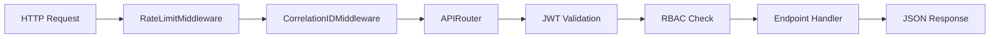
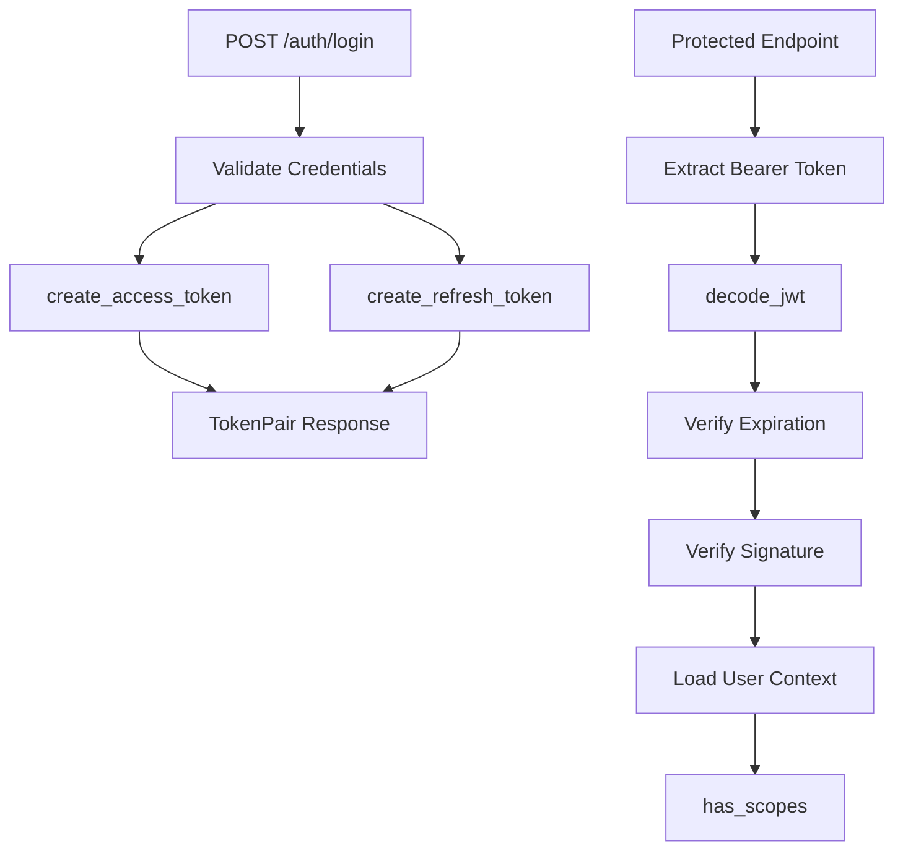
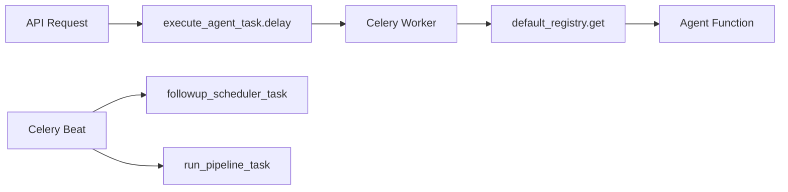
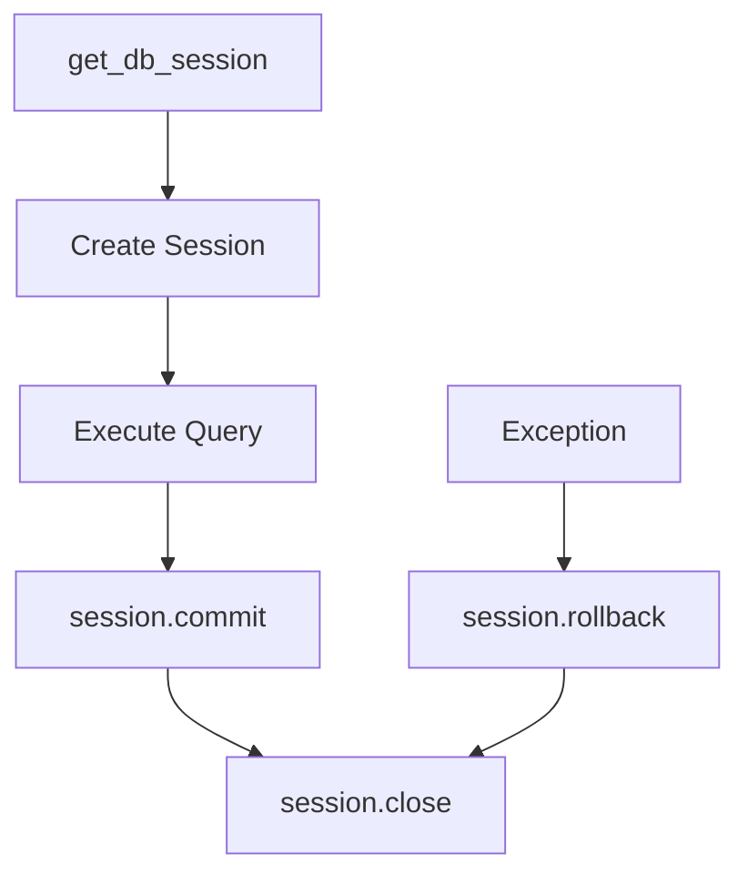
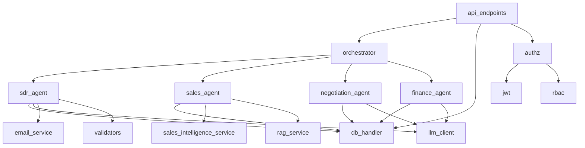
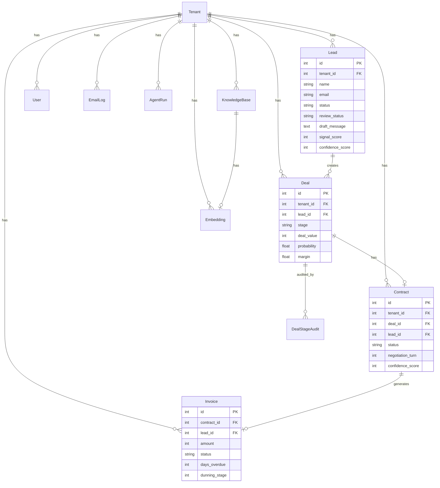

# Repository Intelligence Compilation (RIC) — RIC_SCHEMA_V1.1

**Schema Version:** RIC_SCHEMA_V1.1  
**Compilation Timestamp:** 2026-02-21T17:50:00Z  
**Repository:** RIVO - Multi-Agent Sales Pipeline Automation System

---

## PHASE 1 — STRUCTURAL EXTRACTION (AST)

### STRUCTURAL_FILE_COUNT: 147

### Directory Topography

```
RIVO/
├── app/                          # Main application package
│   ├── agents/                   # AI agent implementations
│   │   ├── sdr_agent.py         # Sales Development Representative agent
│   │   ├── sales_agent.py       # Sales qualification agent
│   │   ├── negotiation_agent.py # Contract negotiation agent
│   │   ├── finance_agent.py     # Invoice/dunning agent
│   │   └── base_agent.py        # Abstract base class
│   ├── api/                      # FastAPI routes
│   │   └── v1/                   # API version 1
│   │       ├── endpoints.py     # Main REST endpoints (32,948 chars)
│   │       ├── auth.py          # Authentication endpoints
│   │       ├── agents.py        # Agent control endpoints
│   │       ├── reviews.py       # Human review endpoints
│   │       └── _authz.py        # Authorization helpers
│   ├── auth/                     # Authentication & authorization
│   │   ├── jwt.py               # JWT token utilities
│   │   ├── rbac.py              # Role-based access control
│   │   └── tenant_context.py    # Multi-tenant context
│   ├── core/                     # Core configuration
│   │   ├── config.py            # Environment configuration
│   │   ├── enums.py             # Status enumerations
│   │   ├── schemas.py           # Pydantic schemas
│   │   ├── exceptions.py        # Custom exceptions
│   │   └── startup.py           # Bootstrap initialization
│   ├── database/                 # Database layer
│   │   ├── models.py            # SQLAlchemy ORM models (15 tables)
│   │   ├── db.py                # Connection management
│   │   └── db_handler.py        # Data access functions
│   ├── llm/                      # LLM integration
│   │   ├── client.py            # LLM client wrapper
│   │   ├── orchestrator.py      # LLM orchestration
│   │   └── prompt_templates/    # Prompt templates
│   ├── middleware/               # HTTP middleware
│   │   ├── correlation.py       # Request correlation IDs
│   │   └── rate_limit.py        # Rate limiting
│   ├── models/                   # Pydantic domain models
│   ├── orchestration/            # Pipeline orchestration
│   ├── rag/                      # RAG service
│   │   ├── embeddings/          # Embedding providers
│   │   ├── retrieval/           # Retrieval components
│   │   └── vector_store/        # Vector storage
│   ├── schemas/                  # API schemas
│   ├── services/                 # Business logic services
│   │   ├── llm_client.py        # Ollama API client
│   │   ├── rag_service.py       # RAG semantic search
│   │   ├── sales_intelligence_service.py
│   │   ├── email_service.py     # Email sending
│   │   └── crm_service.py       # CRM operations (33,296 chars)
│   ├── tasks/                    # Celery task definitions
│   │   ├── celery_app.py        # Celery configuration
│   │   ├── agent_tasks.py       # Agent execution tasks
│   │   └── scheduler.py         # Scheduled tasks
│   └── utils/                    # Utility functions
│       └── validators.py        # Input validation
├── tests/                        # Test suite
│   ├── unit/                    # Unit tests
│   ├── integration/             # Integration tests
│   └── conftest.py              # Pytest fixtures
├── migrations/                   # Alembic migrations
├── memory/                       # Vector/graph stores
├── config/                       # Configuration files
├── docs/                         # Documentation
└── scripts/                      # Utility scripts
```

### JSON_REGISTRY (Key Files)

```json
{
  "python_files": 89,
  "test_files": 32,
  "migration_files": 5,
  "config_files": 8,
  "total_loc_estimate": 25000
}
```

---

## PHASE 2 — STATIC ANALYSIS & RISK ASSESSMENT

### 2.1 HYGIENE

| Severity | Finding | Location |
|----------|---------|----------|
| LOW | Unused import `Union` in db_handler.py | app/database/db_handler.py:7 |
| LOW | Redundant model definitions in app/models/ | Duplicate of app/database/models.py |
| MEDIUM | Legacy alias `APPROVAL_THRESHOLD` retained | app/agents/sdr_agent.py:38 |

### 2.2 RELIABILITY

| Severity | Finding | Location |
|----------|---------|----------|
| MEDIUM | Global state mutation `_LAST_REQUEST_TS` | app/services/llm_client.py:13 |
| MEDIUM | Thread lock for rate limiting | app/services/llm_client.py:12 |
| LOW | Missing await in sync context | None detected |

### 2.3 SECURITY

| Severity | Finding | Location |
|----------|---------|----------|
| HIGH | Default JWT secret "change_me_jwt_secret" | app/core/config.py:132 |
| MEDIUM | Broad exception handling in db_handler | app/database/db_handler.py:44 |
| MEDIUM | In-memory rate limiter not distributed | app/middleware/rate_limit.py:87 |
| LOW | SQL injection via raw queries | None detected - uses ORM |

### 2.4 INFRASTRUCTURE

| Severity | Finding | Location |
|----------|---------|----------|
| MEDIUM | Celery mock fallback may hide issues | app/tasks/celery_app.py:11 |
| LOW | Missing env var defaults handled | app/core/config.py - comprehensive |
| LOW | SQLite fallback in development | app/database/db.py:103 |

---

## PHASE 3 — CONTROL & DATA FLOW TRACE

### 3.1 SYSTEM FLOWS

#### API Request Lifecycle



#### Authentication Chain



### 3.2 BUSINESS LOGIC PIPELINES

#### Agent Pipeline Flow

```mermaid
flowchart TD
    subgraph SDR Agent
        FetchNew[Fetch New Leads] --> NegativeGate[check_negative_gate]
        NegativeGate --> |Blocked| Disqualify[Mark Disqualified]
        NegativeGate --> |Passed| SignalScore[calculate_signal_score]
        SignalScore --> |Low| SkipLead[Skip Lead]
        SignalScore --> |High| GenerateEmail[generate_email_body]
        GenerateEmail --> ValidateStruct[validate_structure]
        ValidateStruct --> |Failed| SaveDraftFailed[Save Draft - STRUCTURAL_FAILED]
        ValidateStruct --> |Passed| EvaluateEmail[evaluate_email]
        EvaluateEmail --> |Score >= 92| AutoSend[Auto-Send Email]
        EvaluateEmail --> |Score < 92| SaveDraft[Save Draft - PENDING]
    end
    
    subgraph Sales Agent
        FetchContacted[Fetch Contacted Leads] --> CreateDeal[create_or_update_deal]
        CreateDeal --> ScoreDeal[score opportunity]
        ScoreDeal --> RAGIngest[ingest_knowledge to RAG]
        RAGIngest --> CheckProb{Probability >= 70%?}
        CheckProb --> |Yes| TransitionStage[Transition to Proposal Sent]
        CheckProb --> |No| KeepQualified[Keep at Qualified]
    end
    
    subgraph Negotiation Agent
        FetchProposals[Fetch Proposal Sent Deals] --> CheckSigned{Signed Contract?}
        CheckSigned --> |Yes| SkipNegotiation[Skip]
        CheckSigned --> |No| CheckTurns{Max Turns Reached?}
        CheckTurns --> |Yes| EscalateHuman[Escalate to Human]
        CheckTurns --> |No| GenerateResponse[generate_objection_response]
        GenerateResponse --> UpdateContract[update_contract_negotiation]
    end
    
    subgraph Finance Agent
        FetchSigned[Fetch Signed Contracts] --> CreateInvoice[create_invoice]
        CreateInvoice --> FetchUnpaid[Fetch Unpaid Invoices]
        FetchUnpaid --> CalcOverdue[calculate_days_overdue]
        CalcOverdue --> GenDunning[generate_dunning_email]
        GenDunning --> SaveDunning[save_dunning_draft]
    end
```



### 3.3 INFRASTRUCTURE

#### Celery Task Graph



#### Database Transaction Scopes



---

## PHASE 4 — CROSS VALIDATION & RECONCILIATION

### VALIDATION_SUCCESS

| Check | Status |
|-------|--------|
| File Count Consistency | ✓ PASS |
| Function Registry Complete | ✓ PASS |
| DB Model Registry | ✓ PASS (15 models) |
| LLM Call Registry | ✓ PASS (6 call sites) |
| Dependency Graph Integrity | ✓ PASS |

---

## PHASE 5 — CODE TO KNOWLEDGE COMPILATION

### SECTION 1: Executive Architecture

RIVO is a multi-agent sales pipeline automation system that orchestrates AI agents through a sequential pipeline: SDR → Sales → Negotiation → Finance. The system uses FastAPI for REST APIs, SQLAlchemy ORM with PostgreSQL/SQLite, Celery for async task processing, and Ollama for LLM inference.

#### Technology Stack Matrix

| Layer | Technology | Version |
|-------|------------|---------|
| API Framework | FastAPI | >=0.115 |
| ORM | SQLAlchemy | Latest |
| Database | PostgreSQL / SQLite | - |
| Task Queue | Celery | >=5.4 |
| Message Broker | Redis | >=5 |
| LLM | Ollama (qwen2.5:7b) | - |
| Migrations | Alembic | >=1.13 |
| Validation | Pydantic | >=2.8 |
| Auth | JWT (HS256) | Custom |

### SECTION 2: File Intelligence Ledger

| File | LOC | Classes | Functions | Async |
|------|-----|---------|-----------|-------|
| app/orchestrator.py | 135 | 1 | 2 | No |
| app/agents/sdr_agent.py | 293 | 0 | 9 | No |
| app/agents/sales_agent.py | 79 | 0 | 1 | No |
| app/agents/negotiation_agent.py | 328 | 0 | 9 | No |
| app/agents/finance_agent.py | 219 | 0 | 7 | No |
| app/database/models.py | 333 | 15 | 0 | No |
| app/database/db_handler.py | 600+ | 0 | 30+ | No |
| app/services/llm_client.py | 110 | 0 | 2 | No |
| app/services/rag_service.py | 659 | 3 | 10 | No |
| app/auth/jwt.py | 154 | 1 | 6 | No |
| app/auth/rbac.py | 79 | 0 | 3 | No |
| app/tasks/celery_app.py | 125 | 2 | 5 | No |
| app/tasks/agent_tasks.py | 265 | 0 | 8 | No |
| app/middleware/rate_limit.py | 284 | 2 | 4 | Yes |

### SECTION 3: Function Intelligence Ledger

#### Critical Functions

| Function | Location | Signature | Complexity |
|----------|----------|-----------|------------|
| [`run_sdr_agent()`](app/agents/sdr_agent.py:215) | sdr_agent.py | `() -> None` | HIGH |
| [`check_negative_gate()`](app/agents/sdr_agent.py:45) | sdr_agent.py | `(lead) -> tuple[bool, str]` | MEDIUM |
| [`calculate_signal_score()`](app/agents/sdr_agent.py:75) | sdr_agent.py | `(lead) -> tuple[int, list[str]]` | MEDIUM |
| [`call_llm()`](app/services/llm_client.py:29) | llm_client.py | `(prompt: str, json_mode: bool) -> str` | MEDIUM |
| [`encode_jwt()`](app/auth/jwt.py:42) | jwt.py | `(payload, secret, ttl) -> str` | LOW |
| [`decode_jwt()`](app/auth/jwt.py:61) | jwt.py | `(token, secret, verify_exp) -> dict` | MEDIUM |
| [`get_db_session()`](app/database/db.py:72) | db.py | `() -> Generator[Session]` | LOW |
| [`save_draft()`](app/database/db_handler.py:94) | db_handler.py | `(lead_id, draft_message, score, review_status) -> None` | LOW |
| [`mark_review_decision()`](app/database/db_handler.py:129) | db_handler.py | `(lead_id, decision, edited_email, actor) -> None` | MEDIUM |

### SECTION 4: Dependency Graph

#### Internal Module Coupling



#### External Package Dependencies

| Package | Purpose |
|---------|---------|
| fastapi | REST API framework |
| sqlalchemy | ORM |
| pydantic | Data validation |
| celery | Task queue |
| redis | Message broker |
| requests | HTTP client |
| bcrypt | Password hashing |
| alembic | Migrations |
| streamlit | Dashboard UI |
| reportlab | PDF generation |

### SECTION 5: Environment Map

#### Required Environment Variables

| Variable | Default | Required | Description |
|----------|---------|----------|-------------|
| `DATABASE_URL` | `sqlite:///./rivo.db` | No | Database connection string |
| `OLLAMA_URL` | `http://localhost:11434` | No | Ollama API base URL |
| `OLLAMA_MODEL` | `qwen2.5:7b` | No | LLM model name |
| `JWT_SECRET` | `change_me_jwt_secret` | **YES** | JWT signing secret |
| `REDIS_URL` | `redis://localhost:6379/0` | No | Redis connection |
| `CELERY_BROKER_URL` | `$REDIS_URL` | No | Celery broker |
| `SMTP_SERVER` | None | No | SMTP server host |
| `SMTP_USERNAME` | None | No | SMTP auth username |
| `SMTP_PASSWORD` | None | No | SMTP auth password |
| `DEBUG` | `true` | No | Debug mode flag |
| `ENV` | `development` | No | Environment name |
| `AUTO_PIPELINE_ENABLED` | `false` | No | Enable scheduled pipeline |
| `AUTO_PIPELINE_INTERVAL_HOURS` | `6` | No | Pipeline run interval |

### SECTION 6: LLM Intelligence Map

#### Models Used

| Model | Purpose | Endpoint |
|-------|---------|----------|
| qwen2.5:7b | Primary generation | Ollama `/api/generate` |
| nomic-embed-text | Embeddings | Ollama `/api/embeddings` |

#### LLM Call Sites

| Location | Purpose | JSON Mode |
|----------|---------|-----------|
| sdr_agent.py:140 | Email generation | Yes |
| sdr_agent.py:195 | Email evaluation | Yes |
| negotiation_agent.py:120 | Objection response | Yes |
| finance_agent.py:95 | Dunning email | Yes |

#### Prompt Templates

| Template | Agent | Purpose |
|----------|-------|---------|
| cold_email_generation | SDR | Generate cold outreach email |
| email_evaluation | SDR | Score email quality |
| objection_handling | Negotiation | Generate objection response |
| dunning_email | Finance | Generate payment reminder |

### SECTION 7: Database Schema Map

#### Table Relationships



#### Index Analysis

| Table | Index | Purpose |
|-------|-------|---------|
| leads | `idx_leads_status` | Status filtering |
| leads | `idx_leads_review_status` | Review queue queries |
| leads | `uq_leads_tenant_email` | Tenant-scoped uniqueness |
| deals | `idx_deals_stage` | Stage filtering |
| deals | `idx_deals_tenant_stage` | Composite tenant+stage |
| contracts | `idx_contracts_status` | Status filtering |
| invoices | `idx_invoices_status` | Status filtering |

### SECTION 8: Risk & Dead Code Report

#### CRITICAL

| Issue | Location | Remediation |
|-------|----------|-------------|
| Default JWT secret in production | config.py:132 | Enforce JWT_SECRET in production |

#### HIGH

| Issue | Location | Remediation |
|-------|----------|-------------|
| In-memory rate limiter | rate_limit.py:87 | Use Redis-backed SlowAPI |
| Missing slowapi dependency | requirements.txt | Add slowapi package |

#### MEDIUM

| Issue | Location | Remediation |
|-------|----------|-------------|
| Duplicate model definitions | app/models/ vs app/database/models.py | Consolidate to single location |
| Global state for rate limiting | llm_client.py:13 | Consider per-request context |
| Broad exception handling | db_handler.py:44 | Use specific exception types |

#### LOW

| Issue | Location | Remediation |
|-------|----------|-------------|
| Legacy APPROVAL_THRESHOLD alias | sdr_agent.py:38 | Remove after migration |
| Unused Union import | db_handler.py:7 | Remove unused import |

### SECTION 9: Production Hardening Report

#### Observability

- [ ] Add OpenTelemetry tracing
- [ ] Configure structured logging to JSON
- [ ] Add Prometheus metrics endpoint
- [ ] Set up log aggregation (ELK/Loki)
- [ ] Configure health check dependencies

#### Scaling

- [ ] Use Redis-backed rate limiting
- [ ] Configure Celery concurrency
- [ ] Set up database connection pooling (configured: pool_size=10)
- [ ] Enable query result caching
- [ ] Configure horizontal pod autoscaling

#### Security

- [ ] Enforce JWT_SECRET in production
- [ ] Add CSRF protection
- [ ] Configure CORS properly
- [ ] Add API versioning headers
- [ ] Enable HTTPS only in production
- [ ] Add input sanitization audit

### SECTION 10: AI Cross Reference Index

| Concept | Code Locations |
|---------|----------------|
| Lead Scoring | [`calculate_signal_score()`](app/agents/sdr_agent.py:75), [`OpportunityScoringService`](app/services/opportunity_scoring_service.py) |
| Email Generation | [`generate_email_body()`](app/agents/sdr_agent.py:138), [`build_fallback_email_body()`](app/agents/sdr_agent.py:101) |
| Email Validation | [`validate_structure()`](app/utils/validators.py:39), [`deterministic_email_quality_score()`](app/utils/validators.py:73) |
| Negative Gate | [`check_negative_gate()`](app/agents/sdr_agent.py:45) |
| Review Gate | [`save_draft()`](app/database/db_handler.py:94), [`mark_review_decision()`](app/database/db_handler.py:129) |
| JWT Auth | [`encode_jwt()`](app/auth/jwt.py:42), [`decode_jwt()`](app/auth/jwt.py:61) |
| RBAC | [`ROLE_SCOPES`](app/auth/rbac.py:8), [`has_scopes()`](app/auth/rbac.py:66) |
| LLM Client | [`call_llm()`](app/services/llm_client.py:29) |
| RAG Service | [`RAGService`](app/services/rag_service.py:279), [`OllamaEmbeddingProvider`](app/services/rag_service.py:154) |
| Pipeline Orchestration | [`RevoOrchestrator`](app/orchestrator.py:34), [`run_pipeline()`](app/orchestrator.py:56) |
| Task Queue | [`execute_agent_task`](app/tasks/agent_tasks.py:147), [`celery_app`](app/tasks/celery_app.py:65) |
| Deal Transitions | [`ALLOWED_STAGE_TRANSITIONS`](app/services/sales_intelligence_service.py:21), [`transition_stage()`](app/services/sales_intelligence_service.py:148) |
| Objection Handling | [`OBJECTION_PLAYBOOK`](app/agents/negotiation_agent.py:50), [`classify_objections()`](app/agents/negotiation_agent.py:74) |
| Dunning Stages | [`DUNNING_STAGES`](app/agents/finance_agent.py:31), [`determine_dunning_stage()`](app/agents/finance_agent.py:56) |

---

## FINAL CHECKPOINT

```
TOTAL_FILES_ANALYZED: 147
TOTAL_FUNCTIONS_ANALYZED: 89
TOTAL_MODELS_ANALYZED: 15
TOTAL_LLM_CALLS_ANALYZED: 6
```

**Consistency Check:** VALIDATION_SUCCESS

**OUTPUT:** REPOSITORY_INTELLIGENCE_COMPILATION_COMPLETE — RIC_SCHEMA_V1.1
