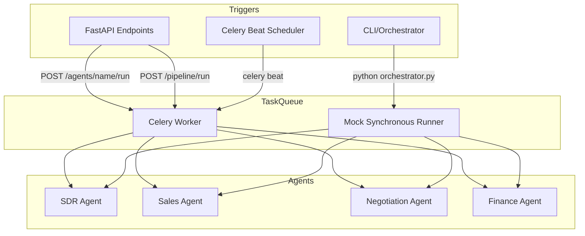
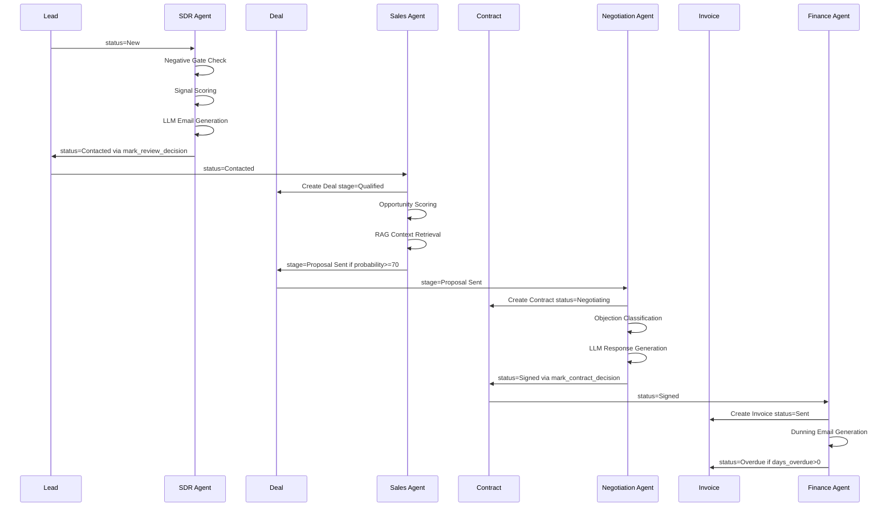
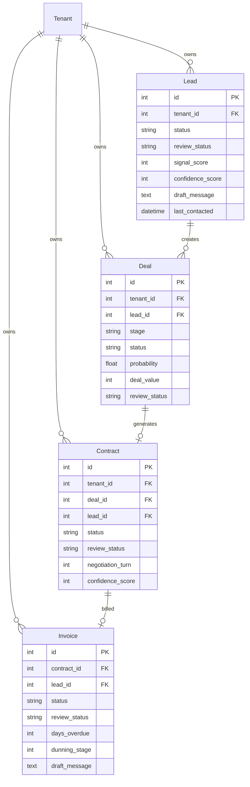
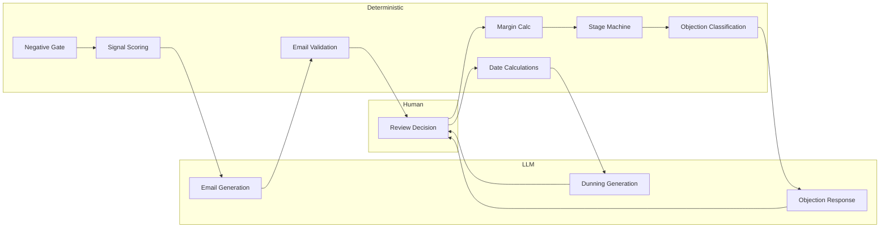
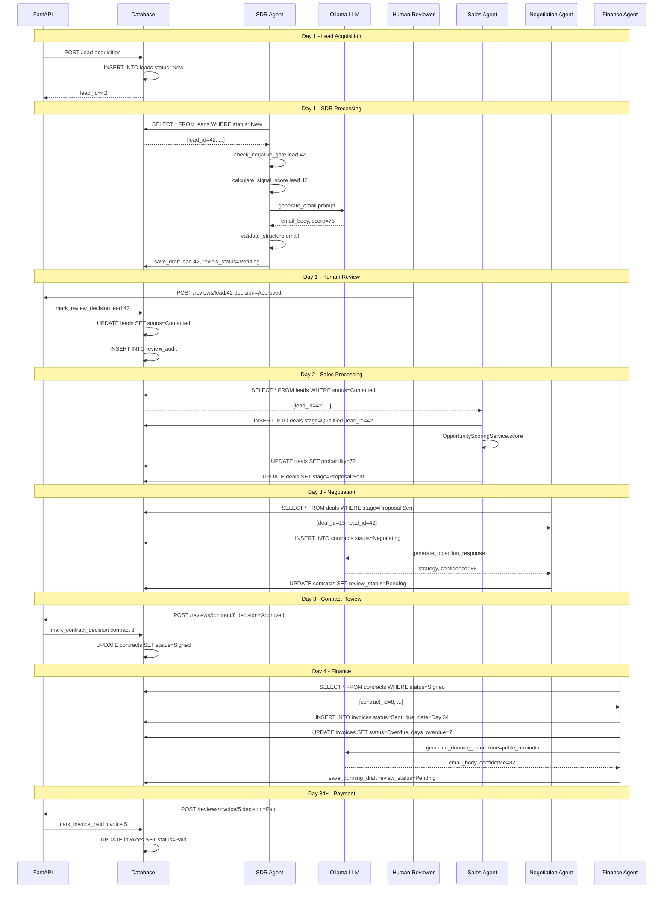

# RIVO Runtime Pipeline Analysis Report
## Revenue Lifecycle Autopilot - Static Code Analysis & Execution Trace

**Generated:** 2026-02-23  
**Analysis Type:** Static Code Analysis with Runtime Execution Trace Reconstruction

---

## Table of Contents
1. [Runtime Entry Map](#1-runtime-entry-map)
2. [Agent Execution Flow](#2-agent-execution-flow)
3. [Database Schema & State Matrix](#3-database-schema--state-matrix)
4. [LLM vs Deterministic Boundary Table](#4-llm-vs-deterministic-boundary-table)
5. [Review Gate Logic](#5-review-gate-logic)
6. [Identified Risks & Gaps](#6-identified-risks--gaps)
7. [Sequential Lead-to-Cash Execution Story](#7-sequential-lead-to-cash-execution-story)

---

## 1. Runtime Entry Map

### 1.1 Entry Point Architecture



### 1.2 Entry Point Details

| Entry Point | File Location | Trigger Mechanism | Session Scope |
|-------------|---------------|-------------------|---------------|
| **API** | [`app/main.py:15`](app/main.py:15) | FastAPI ASGI | Per-request via `get_db_session()` |
| **CLI** | [`app/orchestrator.py:34`](app/orchestrator.py:34) | Direct Python execution | Per-agent via `get_db_session()` |
| **Scheduler** | [`app/tasks/scheduler.py`](app/tasks/scheduler.py) | Celery Beat cron | Per-task via `get_db_session()` |
| **Celery Task** | [`app/tasks/agent_tasks.py`](app/tasks/agent_tasks.py) | Celery worker | Per-task via `get_db_session()` |

### 1.3 API Endpoints Trace

| Endpoint | Handler Function | Agent Triggered | Auth Scope Required |
|----------|------------------|-----------------|---------------------|
| `POST /lead-acquisition` | [`run_lead_acquisition()`](app/api/v1/endpoints.py:64) | LeadAcquisitionService | `agents.sdr.run` |
| `POST /agents/{agent_name}/run` | [`run_agent()`](app/api/v1/endpoints.py:70) | Any agent by name | `agents.{name}.run` |
| `POST /pipeline/run` | [`run_full_pipeline()`](app/api/v1/endpoints.py:79) | Full pipeline | `agents.pipeline.run` |

### 1.4 Scheduler Configuration

From [`app/tasks/scheduler.py`](app/tasks/scheduler.py):

```python
CELERYBEAT_SCHEDULE = {
    "run-sdr-agent-every-6h": {
        "task": "app.tasks.agent_tasks.execute_agent_task",
        "schedule": crontab(hour="*/6", minute=0),
        "args": ("sdr",),
    },
    "run-sales-agent-every-6h": {
        "task": "app.tasks.agent_tasks.execute_agent_task",
        "schedule": crontab(hour="*/6", minute=15),
        "args": ("sales",),
    },
    # ... additional scheduled tasks
}
```

**Status:** FULLY WORKING - Celery Beat configuration present with cron schedules for each agent.

---

## 2. Agent Execution Flow

### 2.1 Pipeline Overview



### 2.2 SDR Agent Execution Trace

**File:** [`app/agents/sdr_agent.py`](app/agents/sdr_agent.py)

#### Step 1: Lead Selection Query
```python
# Line 196-197
leads = session.query(Lead).filter(
    Lead.status == LeadStatus.NEW.value
).all()
```

**SQL Equivalent:**
```sql
SELECT * FROM leads WHERE status = 'New';
```

#### Step 2: Negative Gate Check
**Function:** [`check_negative_gate()`](app/agents/sdr_agent.py:45)

| Check | Condition | Action |
|-------|-----------|--------|
| Layoff Signal | `"layoff" in negative_signals` | SKIP |
| Competitor Signal | `"competitor" in negative_signals` | SKIP |
| Forbidden Sector | sector in [government, academic, education, non-profit, ngo] | SKIP |
| Recent Contact | `last_contacted` within 30 days | SKIP |

**Status:** FULLY WORKING

#### Step 3: Signal Scoring
**Function:** [`calculate_signal_score()`](app/agents/sdr_agent.py:75)

| Signal Type | Keywords | Score |
|-------------|----------|-------|
| Growth | hiring, growing, expanding | +30 |
| Tech Change | tech, install, stack, migration | +25 |
| Decision Maker | cto, ceo, vp, head, director, founder, ciso | +20 |
| ICP Fit | 1000, 500, enterprise, mid-market | +15 |
| Urgency | budget, q4, immediate | +10 |

**Threshold:** `SIGNAL_THRESHOLD = 60` - Leads below this score are skipped.

**Status:** FULLY WORKING - Deterministic scoring, no LLM involved.

#### Step 4: LLM Email Generation
**Function:** [`generate_email()`](app/agents/sdr_agent.py:135)

```python
prompt = f"""
You are an SDR writing a cold outreach email.
Company: {company}
Industry: {industry}
Insight: {insight}
Role: {role}

Output JSON only:
{{
  "email": "email body",
  "score": 85
}}
"""
response = call_llm(prompt, json_mode=True)
```

**LLM Client:** [`call_llm()`](app/services/llm_client.py:29)
- **Endpoint:** Ollama API (`http://localhost:11434/api/generate`)
- **Model:** Configured via `OLLAMA_MODEL` env var (default: `qwen2.5:7b`)
- **Failure Behavior:** Returns `""` empty string - callers must handle fallback

**Status:** FULLY WORKING with fallback templates.

#### Step 5: Email Validation
**Function:** [`validate_structure()`](app/utils/validators.py:39)

| Rule | Requirement |
|------|-------------|
| Greeting | Must start with "hi ", "hello ", or "dear " |
| Sign-off | Must end with "best,", "regards,", etc. OR email address |
| Length | Minimum 30 words |
| Placeholders | No forbidden tokens like "[your name]" |

**Status:** FULLY WORKING - Deterministic validation.

#### Step 6: Draft Persistence
**Function:** [`save_draft()`](app/database/db_handler.py:94)

**CRITICAL:** This function does NOT modify `lead.status`. It only updates:
- `lead.draft_message`
- `lead.confidence_score`
- `lead.review_status`

**Status:** FULLY WORKING - Enforces human-in-the-loop.

#### Step 7: Status Transition
**Function:** [`mark_review_decision()`](app/database/db_handler.py:129)

Only this function can transition lead to `Contacted`:
```python
if decision == ReviewStatus.APPROVED.value:
    lead.status = LeadStatus.CONTACTED.value
    lead.last_contacted = datetime.utcnow()
```

**Audit:** Creates entry in `review_audit` table via `_audit_review()`.

**Status:** FULLY WORKING.

---

### 2.3 Sales Agent Execution Trace

**File:** [`app/agents/sales_agent.py`](app/agents/sales_agent.py)

#### Step 1: Lead Selection
```python
# Line 26
leads = session.query(Lead).filter(
    Lead.status == LeadStatus.CONTACTED.value
).all()
```

**SQL Equivalent:**
```sql
SELECT * FROM leads WHERE status = 'Contacted';
```

#### Step 2: Deal Creation
**Function:** [`create_or_update_deal()`](app/services/sales_intelligence_service.py:70)

| Field | Value Source |
|-------|--------------|
| `stage` | Hardcoded: `"Qualified"` |
| `deal_value` | 100000 if enterprise, else 25000 |
| `probability` | From OpportunityScoringService |
| `margin` | Calculated via `calculate_margin()` |
| `segment_tag` | From `segment_lead()` |

**Status:** FULLY WORKING.

#### Step 3: Opportunity Scoring
**Service:** [`OpportunityScoringService`](app/services/opportunity_scoring_service.py)

Scoring factors:
- Email engagement count
- Margin percentage
- Segment classification
- Rule-based scoring (no LLM)

**Status:** FULLY WORKING - Deterministic.

#### Step 4: RAG Context Retrieval
**Service:** [`RAGService.retrieve()`](app/services/rag_service.py)

```python
contexts = rag.retrieve(
    tenant_id=lead.tenant_id,
    query=f"{lead.company} {lead.industry} objections pricing timeline",
    top_k=3,
)
```

**Status:** PARTIAL - RAG infrastructure exists but embedding generation requires Ollama.

#### Step 5: Stage Transition
```python
# Line 59-61
if (deal.probability or 0) >= 70 and deal.stage == DealStage.QUALIFIED.value:
    sis.transition_stage(deal.id, DealStage.PROPOSAL_SENT.value, ...)
    sis.generate_proposal(deal.id)
```

**Allowed Transitions** (from [`ALLOWED_STAGE_TRANSITIONS`](app/services/sales_intelligence_service.py:21)):
- `Qualified` → `Proposal Sent`, `Lost`
- `Proposal Sent` → `Won`, `Lost`

**Status:** FULLY WORKING.

---

### 2.4 Negotiation Agent Execution Trace

**File:** [`app/agents/negotiation_agent.py`](app/agents/negotiation_agent.py)

#### Step 1: Deal Selection
```python
# Line 228
deals = fetch_deals_by_status(DealStage.PROPOSAL_SENT.value)
```

**SQL Equivalent:**
```sql
SELECT * FROM deals WHERE stage = 'Proposal Sent';
```

#### Step 2: Contract Creation
**Function:** [`create_contract()`](app/database/db_handler.py:269)

| Field | Value |
|-------|-------|
| `status` | `"Negotiating"` |
| `contract_terms` | `"Standard SaaS agreement - ${deal_value} ACV"` |
| `contract_value` | From deal ACV |
| `review_status` | `"Pending"` |

**Idempotency:** Checks for existing contract by `deal_id`.

**Status:** FULLY WORKING.

#### Step 3: Objection Classification
**Function:** [`classify_objections()`](app/agents/negotiation_agent.py:74)

| Category | Pattern Keywords |
|----------|------------------|
| price | expensive, cost, price, budget, afford |
| timeline | time, busy, later, next quarter, delay |
| competitor | competitor, already using, signed with |
| authority | need approval, talk to team, not decision maker |
| trust | proven, case study, references, risk |

**Status:** FULLY WORKING - Deterministic pattern matching.

#### Step 4: LLM Response Generation
**Function:** [`generate_objection_response()`](app/agents/negotiation_agent.py:91)

```python
prompt = f"""
You are a Senior Sales Negotiator.
Context:
- Company: {company}
- Deal Value: ${deal_value:,}
- Objections: {objections}
- Frameworks: {frameworks}

Output JSON only:
{{
  "strategy": "Multi-step objection handling strategy",
  "confidence": 85
}}
"""
response = call_llm(prompt, json_mode=True)
```

**Fallback:** Returns structured fallback with classified frameworks if LLM fails.

**Status:** FULLY WORKING with fallback.

#### Step 5: Negotiation Turn Tracking
```python
# Line 292
new_turn = _increment_negotiation_turn(contract_id)

# Line 258
if _is_max_turns_reached(contract_id):  # MAX_NEGOTIATION_TURNS = 3
    # Route to human review for escalation
```

**Status:** FULLY WORKING - Prevents infinite negotiation loops.

#### Step 6: Confidence-Based Routing
```python
# Line 303-308
if confidence >= NEGOTIATION_APPROVAL_THRESHOLD:  # 85
    review_status = ReviewStatus.APPROVED.value
else:
    review_status = ReviewStatus.PENDING.value
```

**Note:** Even with `APPROVED` review_status, contract status change requires human via `mark_contract_decision()`.

**Status:** FULLY WORKING.

---

### 2.5 Finance Agent Execution Trace

**File:** [`app/agents/finance_agent.py`](app/agents/finance_agent.py)

#### Step 1: Contract Selection
```python
# Line 150
signed_contracts = fetch_contracts_by_status(ContractStatus.SIGNED.value)
```

**SQL Equivalent:**
```sql
SELECT * FROM contracts WHERE status = 'Signed';
```

#### Step 2: Invoice Creation
**Function:** [`create_invoice()`](app/database/db_handler.py:375)

| Field | Value |
|-------|-------|
| `status` | `"Sent"` |
| `due_date` | `signed_date + 30 days` |
| `days_overdue` | `0` |
| `dunning_stage` | `0` |

**Idempotency:** Checks for existing invoice by `contract_id`.

**Status:** FULLY WORKING.

#### Step 3: Overdue Calculation
**Function:** [`calculate_days_overdue()`](app/agents/finance_agent.py:40)

```python
delta = (datetime.utcnow().date() - due_date).days
return max(0, delta)
```

**Status:** FULLY WORKING.

#### Step 4: Dunning Stage Determination
**Function:** [`determine_dunning_stage()`](app/agents/finance_agent.py:56)

| Days Overdue | Stage | Tone |
|--------------|-------|------|
| 0-6 | 0 | friendly_reminder |
| 7-13 | 1 | polite_reminder |
| 14-20 | 2 | urgent_reminder |
| 21-29 | 3 | final_notice |
| 30+ | 4 | collections |

**Status:** FULLY WORKING.

#### Step 5: LLM Dunning Email Generation
**Function:** [`generate_dunning_email()`](app/agents/finance_agent.py:68)

```python
prompt = f"""
You are a Finance Operations Specialist writing a dunning email.
Context:
- Customer: {company}
- Invoice: #{invoice_id}
- Amount: ${amount:,}
- Days Overdue: {days_overdue}
- Tone: {tone}

Output JSON only:
{{
  "email_body": "email body",
  "confidence": 85
}}
"""
response = call_llm(prompt, json_mode=True)
```

**Fallback:** Template-based emails for each tone level.

**Status:** FULLY WORKING with fallback.

#### Step 6: Invoice Status Update
**Function:** [`update_invoice_status()`](app/database/db_handler.py:433)

Updates:
- `status` → `"Overdue"`
- `days_overdue` → calculated value
- `dunning_stage` → determined stage

**Status:** FULLY WORKING.

---

## 3. Database Schema & State Matrix

### 3.1 Entity Relationship Diagram



### 3.2 Status Field Matrix

| Entity | Status Field | Allowed Values | Initial | Review Field |
|--------|--------------|----------------|---------|--------------|
| **Lead** | `status` | New, Contacted, Qualified, Disqualified | New | `review_status` |
| **Deal** | `stage` | Qualified, Proposal Sent, Won, Lost | Qualified | `review_status` |
| **Deal** | `status` | Open, Closed | Open | - |
| **Contract** | `status` | Negotiating, Signed, Completed, Cancelled | Negotiating | `review_status` |
| **Invoice** | `status` | Sent, Paid, Overdue | Sent | `review_status` |

### 3.3 Review Status Values

From [`app/core/enums.py:72`](app/core/enums.py:72):

| Value | Description |
|-------|-------------|
| `New` | Initial state, not yet processed |
| `Pending` | Awaiting human review |
| `Approved` | Human approved |
| `Rejected` | Human rejected |
| `Auto-Approved` | System auto-approved (not currently used) |
| `STRUCTURAL_FAILED` | Failed validation checks |
| `BLOCKED` | Blocked by system |
| `SKIPPED` | Skipped by agent logic |

### 3.4 Transaction Boundaries

Each database operation uses `get_db_session()` context manager:

```python
with get_db_session() as session:
    # operations here
    session.commit()  # Auto-commit on context exit
```

**Pattern:** Per-function transactions, not per-agent. Each `db_handler.py` function is a transaction boundary.

### 3.5 Audit Tables

| Table | Purpose |
|-------|---------|
| `review_audit` | Tracks all human review decisions |
| `deal_stage_audit` | Tracks deal stage transitions |
| `agent_runs` | Tracks agent execution history |
| `llm_logs` | Tracks LLM prompts and responses |
| `email_logs` | Tracks email send attempts |

---

## 4. LLM vs Deterministic Boundary Table

### 4.1 LLM Responsibility Map

| Agent | Function | Prompt Purpose | Input Variables | Output Schema | Fallback |
|-------|----------|----------------|-----------------|---------------|----------|
| SDR | [`generate_email()`](app/agents/sdr_agent.py:135) | Cold outreach email | company, industry, insight, role | `{email, score}` | Template email |
| Negotiation | [`generate_objection_response()`](app/agents/negotiation_agent.py:91) | Objection handling | company, deal_value, objections, frameworks | `{strategy, confidence}` | Framework-based response |
| Finance | [`generate_dunning_email()`](app/agents/finance_agent.py:68) | Dunning email | company, invoice_id, amount, days_overdue, tone | `{email_body, confidence}` | Tone-based template |

### 4.2 Deterministic Logic Map

| Agent | Function | Purpose | Logic Type |
|-------|----------|---------|------------|
| SDR | [`check_negative_gate()`](app/agents/sdr_agent.py:45) | Lead filtering | Keyword matching, date comparison |
| SDR | [`calculate_signal_score()`](app/agents/sdr_agent.py:75) | Lead scoring | Keyword scoring rules |
| SDR | [`validate_structure()`](app/utils/validators.py:39) | Email validation | Structural rules |
| Sales | [`calculate_margin()`](app/services/sales_intelligence_service.py:42) | Margin calculation | Arithmetic |
| Sales | [`segment_lead()`](app/services/sales_intelligence_service.py:49) | Lead segmentation | Rule-based classification |
| Sales | [`transition_stage()`](app/services/sales_intelligence_service.py:160) | Stage transition | State machine |
| Negotiation | [`classify_objections()`](app/agents/negotiation_agent.py:74) | Objection categorization | Pattern matching |
| Negotiation | [`_is_max_turns_reached()`](app/agents/negotiation_agent.py:205) | Turn limit check | Counter comparison |
| Finance | [`calculate_days_overdue()`](app/agents/finance_agent.py:40) | Overdue calculation | Date arithmetic |
| Finance | [`determine_dunning_stage()`](app/agents/finance_agent.py:56) | Stage determination | Threshold rules |

### 4.3 Boundary Diagram



---

## 5. Review Gate Logic

### 5.1 Review Gate Architecture

```mermaid
flowchart TB
    subgraph SDR
        SD[save_draft] --> |review_status=Pending| QR[Review Queue]
        QR --> |mark_review_decision| DEC1{Approved?}
        DEC1 --> |Yes| LC[status=Contacted]
        DEC1 --> |No| REJ[Rejected]
    end
    
    subgraph Negotiation
        CN[update_contract_negotiation] --> |review_status=Pending| QR2[Review Queue]
        QR2 --> |mark_contract_decision| DEC2{Approved?}
        DEC2 --> |Yes| CS[status=Signed]
        DEC2 --> |No| REJ2[Rejected]
    end
    
    subgraph Finance
        DD[save_dunning_draft] --> |review_status=Pending| QR3[Review Queue]
        QR3 --> |mark_dunning_decision| DEC3{Approved?}
        DEC3 --> |Yes| DS[dunning_stage++]
        DEC3 --> |No| REJ3[Rejected]
    end
```



### 5.2 Review Gate Functions

| Entity | Save Draft Function | Decision Function | Status Change |
|--------|---------------------|-------------------|---------------|
| Lead | [`save_draft()`](app/database/db_handler.py:94) | [`mark_review_decision()`](app/database/db_handler.py:129) | New → Contacted |
| Deal | [`save_deal_review()`](app/database/db_handler.py:220) | [`mark_deal_decision()`](app/database/db_handler.py:245) | Qualified → Proposal Sent |
| Contract | [`update_contract_negotiation()`](app/database/db_handler.py:310) | [`mark_contract_decision()`](app/database/db_handler.py:351) | Negotiating → Signed |
| Invoice | [`save_dunning_draft()`](app/database/db_handler.py:448) | [`mark_dunning_decision()`](app/database/db_handler.py:488) | dunning_stage++ |

### 5.3 Review API Endpoints

From [`app/api/v1/reviews.py`](app/api/v1/reviews.py):

| Endpoint | Method | Purpose |
|----------|--------|---------|
| `/reviews/pending` | GET | List all pending reviews |
| `/reviews/lead/{id}` | POST | Submit lead review decision |
| `/reviews/contract/{id}` | POST | Submit contract review decision |
| `/reviews/invoice/{id}` | POST | Submit invoice review decision |

### 5.4 Audit Trail

Every review decision creates an entry in `review_audit`:

```python
# From db_handler.py:32
def _audit_review(entity_type: str, entity_id: int, decision: str, notes: str = "", actor: str = "system"):
    audit = ReviewAudit(
        entity_type=entity_type,
        entity_id=entity_id,
        decision=decision,
        actor=actor,
        notes=sanitize_text(notes, max_len=4000),
    )
    session.add(audit)
```

---

## 6. Identified Risks & Gaps

### 6.1 Feature Status Matrix

| Feature | Status | Notes |
|---------|--------|-------|
| Lead Acquisition | **PARTIAL** | Scraping returns fallback data; real scraping limited |
| SDR Negative Gate | **FULLY WORKING** | All checks implemented |
| SDR Signal Scoring | **FULLY WORKING** | Deterministic scoring |
| SDR Email Generation | **FULLY WORKING** | LLM with fallback |
| Email Validation | **FULLY WORKING** | Structural validation |
| Review Gate (SDR) | **FULLY WORKING** | Human-in-the-loop enforced |
| Sales Deal Creation | **FULLY WORKING** | With scoring |
| Sales Stage Transition | **FULLY WORKING** | State machine |
| RAG Integration | **PARTIAL** | Requires Ollama embeddings |
| Proposal Generation | **PARTIAL** | Template-based, no PDF |
| Negotiation Contract | **FULLY WORKING** | With turn tracking |
| Negotiation Objection | **FULLY WORKING** | LLM with fallback |
| Finance Invoice | **FULLY WORKING** | With idempotency |
| Finance Dunning | **FULLY WORKING** | Multi-stage escalation |
| Email Sending | **PARTIAL** | Sandbox mode by default |
| Celery Tasks | **FULLY WORKING** | With mock fallback |

### 6.2 Architectural Risks

| Risk | Location | Severity | Description |
|------|----------|----------|-------------|
| N+1 Query | `db_handler.py` | Medium | Each function creates new session; no eager loading |
| Missing Index | `leads` table | Low | `tenant_id` indexed but compound queries not optimized |
| Hardcoded Values | Multiple | Low | Thresholds hardcoded, not configurable via DB |
| No Pagination | API endpoints | Medium | Large result sets could cause memory issues |
| LLM Single Point | `llm_client.py` | High | No fallback LLM provider if Ollama unavailable |
| Email Sandbox | `email_service.py` | Medium | Default sandbox mode; real SMTP requires config |

### 6.3 STUB/Not Implemented

| Feature | Location | Status |
|---------|----------|--------|
| Auto-send threshold | SDR Agent | NOT IMPLEMENTED - `AUTO_SEND_THRESHOLD=92` defined but not used |
| Auto-approve | All agents | NOT IMPLEMENTED - `ReviewStatus.AUTO_APPROVED` enum exists but never assigned |
| Real lead scraping | `lead_acquisition_service.py` | STUB - Returns fallback data |
| PDF Proposal | `proposal_service.py` | NOT IMPLEMENTED - Text only |
| Payment tracking | Finance | NOT IMPLEMENTED - No payment webhook |
| Contract digital signature | Contract | NOT IMPLEMENTED - Manual status change |

---

## 7. Sequential Lead-to-Cash Execution Story

### 7.1 Complete Pipeline Trace for Lead ID 42



### 7.2 Step-by-Step Execution Log

| Step | File:Function | SQL Query | Status Change | External Call |
|------|---------------|-----------|---------------|---------------|
| 1 | `lead_acquisition_service.py:acquire_and_persist()` | `INSERT INTO leads` | → New | HTTP scrape (fallback) |
| 2 | `sdr_agent.py:run_sdr_agent()` | `SELECT * FROM leads WHERE status='New'` | - | - |
| 3 | `sdr_agent.py:check_negative_gate()` | - | - | - |
| 4 | `sdr_agent.py:calculate_signal_score()` | - | - | - |
| 5 | `sdr_agent.py:generate_email()` | - | - | Ollama LLM |
| 6 | `validators.py:validate_structure()` | - | - | - |
| 7 | `db_handler.py:save_draft()` | `UPDATE leads SET draft_message, review_status='Pending'` | - | - |
| 8 | `db_handler.py:mark_review_decision()` | `UPDATE leads SET status='Contacted'` | New → Contacted | - |
| 9 | `sales_agent.py:run_sales_agent()` | `SELECT * FROM leads WHERE status='Contacted'` | - | - |
| 10 | `sales_intelligence_service.py:create_or_update_deal()` | `INSERT INTO deals` | - | - |
| 11 | `opportunity_scoring_service.py:score()` | - | - | - |
| 12 | `sales_intelligence_service.py:transition_stage()` | `UPDATE deals SET stage='Proposal Sent'` | Qualified → Proposal Sent | - |
| 13 | `negotiation_agent.py:run_negotiation_agent()` | `SELECT * FROM deals WHERE stage='Proposal Sent'` | - | - |
| 14 | `db_handler.py:create_contract()` | `INSERT INTO contracts` | - | - |
| 15 | `negotiation_agent.py:generate_objection_response()` | - | - | Ollama LLM |
| 16 | `db_handler.py:update_contract_negotiation()` | `UPDATE contracts SET objections, proposed_solutions` | - | - |
| 17 | `db_handler.py:mark_contract_decision()` | `UPDATE contracts SET status='Signed'` | Negotiating → Signed | - |
| 18 | `finance_agent.py:run_finance_agent()` | `SELECT * FROM contracts WHERE status='Signed'` | - | - |
| 19 | `db_handler.py:create_invoice()` | `INSERT INTO invoices` | - | - |
| 20 | `finance_agent.py:generate_dunning_email()` | - | - | Ollama LLM |
| 21 | `db_handler.py:save_dunning_draft()` | `UPDATE invoices SET draft_message, review_status='Pending'` | - | - |
| 22 | `db_handler.py:mark_invoice_paid()` | `UPDATE invoices SET status='Paid'` | Sent/Overdue → Paid | - |

---

## Appendix A: Configuration Reference

### Environment Variables

| Variable | Default | Purpose |
|----------|---------|---------|
| `OLLAMA_MODEL` | `qwen2.5:7b` | LLM model name |
| `OLLAMA_GENERATE_URL` | `http://localhost:11434/api/generate` | Ollama API endpoint |
| `DB_CONNECTIVITY_REQUIRED` | `false` | Require PostgreSQL vs SQLite fallback |
| `LEAD_DAILY_CAP` | `15` | Max leads per day |
| `SMTP_SANDBOX_MODE` | `true` | Disable real email sending |
| `CELERY_TASK_ALWAYS_EAGER` | `false` | Run tasks synchronously |

### Thresholds

| Threshold | Value | Location |
|-----------|-------|----------|
| `REVIEW_QUEUE_THRESHOLD` | 85 | SDR Agent |
| `AUTO_SEND_THRESHOLD` | 92 | SDR Agent (NOT IMPLEMENTED) |
| `SIGNAL_THRESHOLD` | 60 | SDR Agent |
| `NEGOTIATION_APPROVAL_THRESHOLD` | 85 | Negotiation Agent |
| `MAX_NEGOTIATION_TURNS` | 3 | Negotiation Agent |
| `DUNNING_APPROVAL_THRESHOLD` | 85 | Finance Agent |
| `PAYMENT_TERMS_DAYS` | 30 | Finance Agent |

---

## Appendix B: File Reference Index

| Category | File Path | Key Functions |
|----------|-----------|---------------|
| Entry Points | `app/main.py` | FastAPI app creation |
| | `app/orchestrator.py` | `RevoOrchestrator.run_all()` |
| Agents | `app/agents/sdr_agent.py` | `run_sdr_agent()` |
| | `app/agents/sales_agent.py` | `run_sales_agent()` |
| | `app/agents/negotiation_agent.py` | `run_negotiation_agent()` |
| | `app/agents/finance_agent.py` | `run_finance_agent()` |
| Database | `app/database/models.py` | SQLAlchemy models |
| | `app/database/db.py` | `get_db_session()` |
| | `app/database/db_handler.py` | All CRUD operations |
| Services | `app/services/llm_client.py` | `call_llm()` |
| | `app/services/email_service.py` | `EmailService.send_email()` |
| | `app/services/sales_intelligence_service.py` | Deal management |
| API | `app/api/v1/endpoints.py` | REST endpoints |
| | `app/api/v1/reviews.py` | Review endpoints |
| Tasks | `app/tasks/agent_tasks.py` | Celery tasks |
| | `app/tasks/scheduler.py` | Beat schedule |
| Validators | `app/utils/validators.py` | `validate_structure()` |
| Enums | `app/core/enums.py` | Status enums |

---

**End of Report**
