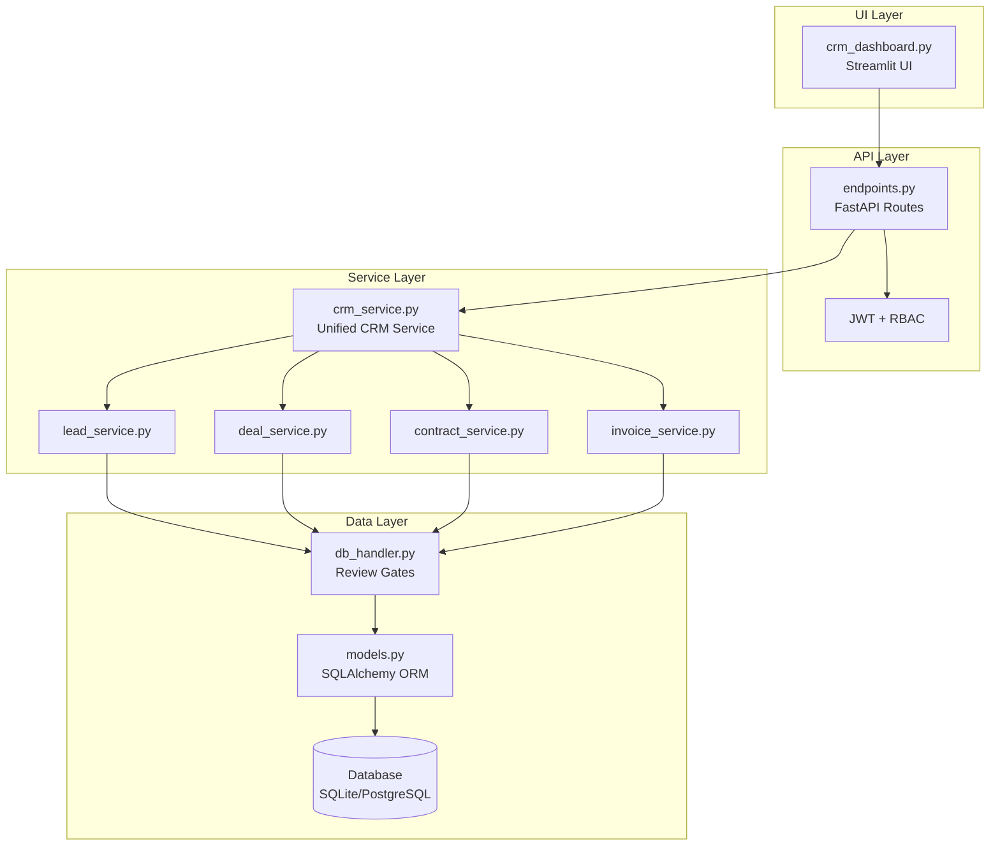
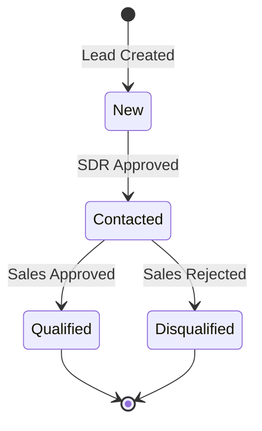
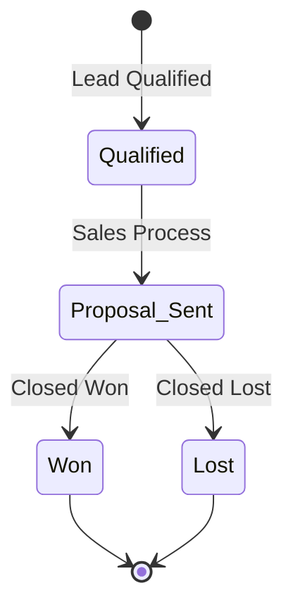

# CRM Dashboard Implementation Plan for RIVO

## Executive Summary

This plan adapts the requirements from `new_dashboard.md` to the current RIVO project architecture. The implementation creates a unified CRM service layer with proper pagination, sorting, tenant isolation, and a Streamlit dashboard for managing Leads, Deals, Contracts, and Invoices.

---

## 🔒 NON-NEGOTIABLE RULES (Adapted for RIVO)

| Rule | RIVO Implementation |
|------|---------------------|
| All reads are tenant-scoped | Use `tenant_id` filter on all queries via `get_db_session()` |
| All writes go through crm_service.py | New `app/services/crm_service.py` as single entry point |
| All manual mutations log CRM_MANUAL_OVERRIDE | Use existing `ReviewAudit` table with `actor="CRM_MANUAL_OVERRIDE"` |
| All stage transitions validated | Use existing enums in `app/core/enums.py` with Title Case values |
| Pagination is server-side | Offset/limit with total count in responses |
| Sorting is server-side | Whitelisted sort fields only, no raw SQL |
| No raw SQL | SQLAlchemy ORM only via `get_db_session()` |
| No bypassing review gates | Use existing `mark_review_decision()` for lead approvals |

---

## 🏗 Architecture Overview



---

## 📋 Implementation Tasks

### Phase 1: CRM Service Layer

#### 1.1 Create `app/services/crm_service.py`

**Pagination Model:**
```python
@dataclass
class PaginatedResult:
    items: list[dict]
    total: int
    page: int
    page_size: int
    total_pages: int
```

**Query Parameters:**
- `page`: int (default 1, min 1)
- `page_size`: int (default 25, min 1, max 100)
- `sort_by`: str (must be in whitelist)
- `sort_order`: str ("asc" or "desc")
- `search`: str (optional, ILIKE search)
- `status`: str (optional, must match enum values)

**Safe Sorting Whitelists:**
```python
LEAD_SORT_FIELDS = {
    "created_at": Lead.created_at,
    "status": Lead.status,
    "company": Lead.company,
    "name": Lead.name,
    "signal_score": Lead.signal_score,
}

DEAL_SORT_FIELDS = {
    "created_at": Deal.created_at,
    "stage": Deal.stage,
    "company": Deal.company,
    "deal_value": Deal.deal_value,
    "probability": Deal.probability,
}

CONTRACT_SORT_FIELDS = {
    "created_at": Contract.last_updated,
    "status": Contract.status,
    "contract_value": Contract.contract_value,
}

INVOICE_SORT_FIELDS = {
    "due_date": Invoice.due_date,
    "status": Invoice.status,
    "amount": Invoice.amount,
}
```

#### 1.2 List Methods

Each method must:
1. Filter by `tenant_id`
2. Apply optional status filter (validate against enum)
3. Apply search (ILIKE on key fields)
4. Apply sorting (whitelist only)
5. Apply offset/limit
6. Return `PaginatedResult`

```python
def get_leads(
    tenant_id: int,
    page: int = 1,
    page_size: int = 25,
    sort_by: str = "created_at",
    sort_order: str = "desc",
    search: str | None = None,
    status: str | None = None,
) -> PaginatedResult:
    ...

def get_deals(...) -> PaginatedResult: ...
def get_contracts(...) -> PaginatedResult: ...
def get_invoices(...) -> PaginatedResult: ...
```

#### 1.3 Mutation Methods

Each mutation must:
1. Validate tenant ownership
2. Validate stage transitions using existing enums
3. Log to `ReviewAudit` with `actor="CRM_MANUAL_OVERRIDE"`
4. Commit safely with rollback on error

```python
def approve_lead_draft_safe(
    tenant_id: int,
    lead_id: int,
    edited_email: str | None = None,
    actor: str = "CRM_MANUAL_OVERRIDE"
) -> Lead | None:
    """Approve lead draft - uses existing mark_review_decision."""
    ...

def reject_lead_draft_safe(
    tenant_id: int,
    lead_id: int,
    reason: str = "",
    actor: str = "CRM_MANUAL_OVERRIDE"
) -> Lead | None:
    ...

def override_deal_stage_safe(
    tenant_id: int,
    deal_id: int,
    new_stage: str,
    reason: str = "",
    actor: str = "CRM_MANUAL_OVERRIDE"
) -> Deal | None:
    """Validate stage transition using DealStage enum."""
    ...

def mark_invoice_paid_safe(
    tenant_id: int,
    invoice_id: int,
    actor: str = "CRM_MANUAL_OVERRIDE"
) -> Invoice | None:
    ...

def trigger_agent_safe(
    tenant_id: int,
    agent_name: str,
    user_id: int
) -> dict:
    """Trigger agent via existing Celery task."""
    ...
```

---

### Phase 2: API Endpoints

#### 2.1 Add CRM Endpoints to `app/api/v1/endpoints.py`

**New endpoints:**

```python
# Leads
@router.get("/crm/leads")
def crm_list_leads(
    page: int = Query(default=1, ge=1),
    page_size: int = Query(default=25, ge=1, le=100),
    sort_by: str = Query(default="created_at"),
    sort_order: str = Query(default="desc"),
    search: str | None = Query(default=None),
    status: str | None = Query(default=None),
    authorization: str | None = Header(default=None, alias="Authorization"),
) -> dict:
    """Paginated lead list for CRM dashboard."""
    ...

@router.post("/crm/leads/{lead_id}/approve")
def crm_approve_lead(
    lead_id: int,
    payload: ApproveLeadRequest,
    authorization: str | None = Header(default=None, alias="Authorization"),
) -> dict:
    ...

@router.post("/crm/leads/{lead_id}/reject")
def crm_reject_lead(
    lead_id: int,
    payload: RejectLeadRequest,
    authorization: str | None = Header(default=None, alias="Authorization"),
) -> dict:
    ...

# Deals
@router.get("/crm/deals")
def crm_list_deals(...) -> dict: ...

@router.post("/crm/deals/{deal_id}/override-stage")
def crm_override_deal_stage(...) -> dict: ...

# Contracts
@router.get("/crm/contracts")
def crm_list_contracts(...) -> dict: ...

@router.post("/crm/contracts/{contract_id}/sign")
def crm_sign_contract(...) -> dict: ...

# Invoices
@router.get("/crm/invoices")
def crm_list_invoices(...) -> dict: ...

@router.post("/crm/invoices/{invoice_id}/mark-paid")
def crm_mark_invoice_paid(...) -> dict: ...
```

#### 2.2 Response Format

```json
{
  "items": [...],
  "total": 542,
  "page": 1,
  "page_size": 25,
  "total_pages": 22
}
```

---

### Phase 3: RBAC Updates

#### 3.1 Update `app/auth/rbac.py`

Add new CRM scopes:

```python
ROLE_SCOPES: dict[str, set[str]] = {
    "admin": {"*"},
    "sales": {
        "crm.leads.read",
        "crm.leads.write",
        "crm.deals.read",
        "crm.deals.write",
        "crm.contracts.read",
        "agents.sales.run",
        "agents.negotiation.run",
        "runs.read",
        "reviews.decision",
        "metrics.read",
    },
    "sdr": {
        "crm.leads.read",
        "crm.leads.write",
        "agents.sdr.run",
        "runs.read",
        "reviews.decision",
        "metrics.read",
    },
    "finance": {
        "crm.invoices.read",
        "crm.invoices.write",
        "crm.contracts.read",
        "agents.finance.run",
        "runs.read",
        "reviews.decision",
        "metrics.read",
    },
    "viewer": {
        "crm.leads.read",
        "crm.deals.read",
        "crm.contracts.read",
        "crm.invoices.read",
        "runs.read",
        "metrics.read",
    },
}
```

---

### Phase 4: Streamlit Dashboard

#### 4.1 Create `app/crm_dashboard.py`

**Structure:**
```python
st.set_page_config(
    page_title="RIVO CRM Dashboard",
    layout="wide",
    initial_sidebar_state="expanded"
)

# Sidebar: Tenant/User context
with st.sidebar:
    st.title("RIVO CRM")
    tenant_id = st.number_input("Tenant ID", value=1, min_value=1)
    role = st.selectbox("Role", ["admin", "sales", "sdr", "finance", "viewer"])

# Main tabs
tabs = st.tabs(["Leads", "Deals", "Contracts", "Invoices"])

# Each tab:
# - Filter row: status dropdown + search input
# - Pagination controls: page number, page size
# - Data table with action buttons
# - Confirmation modals for mutations
```

**Pagination UI Pattern:**
```
[< Prev] [Page 1 of 22] [Next >]  |  [25] records per page  |  Total: 542
```

**Action Buttons Per Row:**
- Leads: Approve, Reject, View Details
- Deals: Override Stage, View Details
- Contracts: Sign, View Details
- Invoices: Mark Paid, View Details

---

## 📊 Entity Status Flows (Title Case)



### Deal Stages


### Contract Status
| Status | Description |
|--------|-------------|
| Negotiating | Active negotiation |
| Signed | Contract signed |
| Completed | Work completed |
| Cancelled | Contract cancelled |

### Invoice Status
| Status | Description |
|--------|-------------|
| Sent | Invoice sent |
| Paid | Payment received |
| Overdue | Past due date |

---

## 🧪 Testing Strategy

### Unit Tests: `tests/unit/services/test_crm_service.py`

```python
def test_get_leads_pagination():
    """Test lead pagination returns correct page info."""
    
def test_get_leads_tenant_isolation():
    """Test leads are filtered by tenant_id."""
    
def test_get_leads_sorting_whitelist():
    """Test invalid sort field raises error."""
    
def test_get_leads_search():
    """Test ILIKE search on name, email, company."""
    
def test_override_deal_stage_valid_transition():
    """Test valid stage transition."""
    
def test_override_deal_stage_invalid_transition():
    """Test invalid stage transition raises error."""
    
def test_audit_log_on_mutation():
    """Test CRM_MANUAL_OVERRIDE audit entry created."""
```

### Integration Tests: `tests/test_crm_api.py`

```python
def test_crm_leads_list_authenticated():
    """Test authenticated user can list leads."""
    
def test_crm_leads_list_unauthorized():
    """Test unauthorized user gets 401."""
    
def test_crm_leads_list_rbac():
    """Test RBAC scope enforcement."""
    
def test_crm_approve_lead():
    """Test lead approval via API."""
```

---

## 📁 Files to Create/Modify

| File | Action | Description |
|------|--------|-------------|
| `app/services/crm_service.py` | Create | Unified CRM service with pagination |
| `app/api/v1/endpoints.py` | Modify | Add CRM endpoints |
| `app/auth/rbac.py` | Modify | Add CRM scopes |
| `app/crm_dashboard.py` | Create | Streamlit CRM dashboard |
| `tests/unit/services/test_crm_service.py` | Create | Unit tests |
| `tests/test_crm_api.py` | Create | Integration tests |

---

## ⚠️ Critical Constraints

1. **Status Enums Use Title Case**: All status values must use Title Case (`"New"`, `"Contacted"`, etc.) as defined in [`app/core/enums.py`](app/core/enums.py)

2. **Review Gate Semantics**: Lead approval must go through [`mark_review_decision()`](app/database/db_handler.py) - never bypass

3. **Tenant Isolation**: Every query must include `tenant_id` filter

4. **Database Session**: Use `get_db_session()` context manager pattern

5. **Audit Trail**: All manual mutations must log to `ReviewAudit` with `actor="CRM_MANUAL_OVERRIDE"`

---

## 🚀 Execution Order

1. Create `crm_service.py` with pagination and list methods
2. Add mutation methods with audit logging
3. Add CRM API endpoints
4. Update RBAC scopes
5. Create Streamlit dashboard
6. Write unit tests
7. Write integration tests
8. Run full test suite: `pytest -q`
