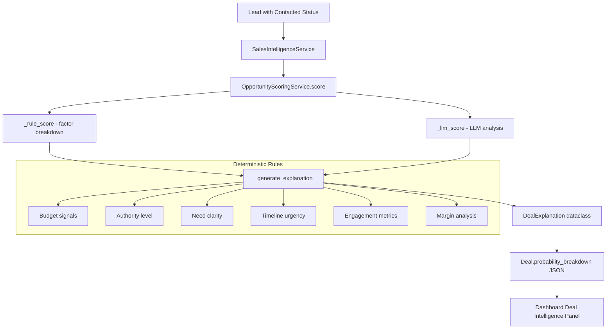

# Deal Explainability Panel Implementation Plan

## Executive Summary

This plan outlines the implementation of a Deal Explainability Panel in the RIVO Multi-Agent Dashboard. The panel will display deterministic, structured reasoning for Deal probability scores, including strengths, risks, strategic fit, and system recommendations.

## Current State Analysis

### Deal Model - Already Has Required Fields

The [`Deal`](app/database/models.py:60) model already has the necessary JSON field:

```python
probability_breakdown = Column(JSON)  # Line 83 - Can store structured explanation
probability_explanation = Column(Text)  # Line 84 - Current text explanation
probability_confidence = Column(Integer)  # Line 85 - Confidence score
```

**Key Finding**: No database migration is required. The `probability_breakdown` JSON field can store the structured explanation data.

### OpportunityScoringService - Current Output

The [`OpportunityScoringService`](app/services/opportunity_scoring_service.py:23) returns an `OpportunityScore` dataclass:

```python
@dataclass
class OpportunityScore:
    rule_score: int
    llm_score: int
    final_probability: float
    confidence: int
    breakdown: dict  # Currently stores factor scores
    explanation: str  # Text explanation
```

The current `breakdown` dict contains:
- `budget_signal`: int
- `authority_level`: int
- `need_clarity`: int
- `timeline_urgency`: int
- `email_engagement`: int
- `followup_responsiveness`: int

### SalesIntelligenceService - Current Flow

The [`SalesIntelligenceService.create_or_update_deal()`](app/services/sales_intelligence_service.py:70) method:
1. Calls `self.scoring.score(lead, email_log_count=engagement_count)`
2. Stores results: `deal.probability_breakdown = score.breakdown`
3. Persists to database

### Dashboard - Current Deal Display

The [`multi_agent_dashboard.py`](app/multi_agent_dashboard.py:160) Tab 2 displays:
- Deal metrics (Stage, Deal Value, BANT Score)
- AI Qualification Analysis (probability_explanation)
- Probability and Confidence metrics
- Segment tag

---

## Implementation Plan

### Step 1: Create DealExplanation Data Structure

Create a new dataclass in `app/services/opportunity_scoring_service.py`:

```python
@dataclass
class DealExplanation:
    probability: float
    confidence: str  # High, Medium, Low
    positive_factors: List[str]
    negative_factors: List[str]
    risk_flags: List[str]
    strategic_fit: str
    recommendation: str  # APPROVE, REVIEW, REJECT
```

### Step 2: Enhance OpportunityScoringService

Add deterministic rule-based explanation generation:

```python
def _generate_explanation(
    self, 
    breakdown: dict, 
    final_probability: float,
    margin_result: MarginResult,
    segment: str
) -> DealExplanation:
    positive_factors = []
    negative_factors = []
    risk_flags = []
    
    # Budget analysis
    if breakdown.get('budget_signal', 0) >= 15:
        positive_factors.append('Budget signals detected - approved funding or budget allocated')
    elif breakdown.get('budget_signal', 0) < 10:
        negative_factors.append('Limited budget clarity - no confirmed budget')
    
    # Authority analysis
    if breakdown.get('authority_level', 0) >= 15:
        positive_factors.append('Decision maker engaged - C-level or VP contact')
    elif breakdown.get('authority_level', 0) < 15:
        negative_factors.append('Non-decision maker contact - may require escalation')
    
    # Need analysis
    if breakdown.get('need_clarity', 0) >= 15:
        positive_factors.append('Clear pain points identified - urgent need expressed')
    elif breakdown.get('need_clarity', 0) < 10:
        negative_factors.append('Unclear need - no explicit pain points')
    
    # Timeline analysis
    if breakdown.get('timeline_urgency', 0) >= 15:
        positive_factors.append('Active buying timeline - Q4 or immediate purchase intent')
    elif breakdown.get('timeline_urgency', 0) < 10:
        negative_factors.append('Extended timeline - no urgency detected')
    
    # Engagement analysis
    if breakdown.get('email_engagement', 0) >= 15:
        positive_factors.append('High engagement - multiple email interactions')
    elif breakdown.get('email_engagement', 0) < 8:
        negative_factors.append('Low engagement - minimal response activity')
    
    # Margin risk
    if margin_result.low_margin_flag:
        risk_flags.append('Low margin deal - below 20% threshold')
    
    # Follow-up responsiveness
    if breakdown.get('followup_responsiveness', 0) < 10:
        risk_flags.append('Slow follow-up response - may indicate low priority')
    
    # Confidence level
    if final_probability >= 75:
        confidence = 'High'
    elif final_probability >= 50:
        confidence = 'Medium'
    else:
        confidence = 'Low'
    
    # Strategic fit
    strategic_fit = self._determine_strategic_fit(segment, positive_factors, risk_flags)
    
    # Recommendation
    if final_probability >= 75 and len(risk_flags) == 0:
        recommendation = 'APPROVE'
    elif final_probability >= 50 or len(positive_factors) >= 3:
        recommendation = 'REVIEW'
    else:
        recommendation = 'REJECT'
    
    return DealExplanation(
        probability=final_probability,
        confidence=confidence,
        positive_factors=positive_factors,
        negative_factors=negative_factors,
        risk_flags=risk_flags,
        strategic_fit=strategic_fit,
        recommendation=recommendation
    )
```

### Step 3: Update OpportunityScore Dataclass

Extend the existing dataclass to include the structured explanation:

```python
@dataclass
class OpportunityScore:
    rule_score: int
    llm_score: int
    final_probability: float
    confidence: int
    breakdown: dict
    explanation: str
    deal_explanation: Optional[DealExplanation] = None  # NEW
```

### Step 4: Update SalesIntelligenceService

Modify [`create_or_update_deal()`](app/services/sales_intelligence_service.py:70) to pass margin and segment to scoring:

```python
def create_or_update_deal(self, lead: Lead, actor: str = "sales_agent") -> Deal | None:
    # ... existing code ...
    
    score = self.scoring.score(
        lead, 
        email_log_count=engagement_count,
        margin_result=margin_result,  # NEW
        segment=segment  # NEW
    )
    
    # ... existing code ...
    
    # Store structured explanation in probability_breakdown
    if score.deal_explanation:
        deal.probability_breakdown = asdict(score.deal_explanation)
```

### Step 5: Update Dashboard UI

Add Deal Intelligence expander in [`multi_agent_dashboard.py`](app/multi_agent_dashboard.py:160):

```python
# After existing metrics display (around line 225)

# Deal Intelligence Panel
breakdown = deal.get('probability_breakdown', {}) or {}
if breakdown and isinstance(breakdown, dict) and 'positive_factors' in breakdown:
    with st.expander("🔎 Deal Intelligence", expanded=False):
        # Probability and Confidence row
        col_p, col_c = st.columns(2)
        with col_p:
            prob = breakdown.get('probability', 0)
            st.metric("Win Probability", f"{prob:.0f}%")
        with col_c:
            confidence = breakdown.get('confidence', 'Medium')
            confidence_colors = {'High': '🟢', 'Medium': '🟡', 'Low': '🔴'}
            st.metric("Confidence", f"{confidence_colors.get(confidence, '🟡')} {confidence}")
        
        st.markdown("---")
        
        # Positive Factors
        positive_factors = breakdown.get('positive_factors', [])
        if positive_factors:
            st.markdown("**✅ Strengths**")
            for factor in positive_factors:
                st.markdown(f"- {factor}")
        
        # Negative Factors
        negative_factors = breakdown.get('negative_factors', [])
        if negative_factors:
            st.markdown("**⚠️ Concerns**")
            for factor in negative_factors:
                st.markdown(f"- {factor}")
        
        # Risk Flags
        risk_flags = breakdown.get('risk_flags', [])
        if risk_flags:
            st.markdown("**🚨 Risk Flags**")
            for flag in risk_flags:
                st.markdown(f"- {flag}")
        
        # Strategic Fit
        strategic_fit = breakdown.get('strategic_fit', 'N/A')
        st.markdown(f"**🎯 Strategic Fit:** {strategic_fit}")
        
        # Recommendation with color coding
        recommendation = breakdown.get('recommendation', 'REVIEW')
        rec_colors = {'APPROVE': '🟢', 'REVIEW': '🟡', 'REJECT': '🔴'}
        rec_color = rec_colors.get(recommendation, '🟡')
        st.markdown(f"**📋 System Recommendation:** {rec_color} **{recommendation}**")
```

---

## Data Flow Diagram



---

## Backward Compatibility

For deals without structured explanation data, the dashboard will:

1. Check if `probability_breakdown` contains `positive_factors` key
2. If not present, display the existing `probability_explanation` text area
3. Show info message: "Detailed intelligence not available for this deal"

```python
if breakdown and isinstance(breakdown, dict) and 'positive_factors' in breakdown:
    # Show Deal Intelligence Panel
else:
    st.info("Detailed deal intelligence not available. Run the sales agent to generate analysis.")
```

---

## Files to Modify

| File | Changes |
|------|---------|
| `app/services/opportunity_scoring_service.py` | Add `DealExplanation` dataclass, `_generate_explanation()` method, update `score()` |
| `app/services/sales_intelligence_service.py` | Pass margin/segment to scoring, store structured explanation |
| `app/multi_agent_dashboard.py` | Add Deal Intelligence expander in Tab 2 |

---

## Testing Strategy

1. **Unit Tests**: Test `_generate_explanation()` with various breakdown scenarios
2. **Integration Tests**: Verify end-to-end flow from scoring to dashboard display
3. **Backward Compatibility Tests**: Ensure deals with old `probability_breakdown` format display gracefully

---

## Constraints Compliance

- ✅ No LLM calls for UI text - all text from deterministic service logic
- ✅ No breaking changes to existing dashboard filters or actions
- ✅ Separation of concerns: Logic in Services, Display in Dashboard
- ✅ Backward compatibility for deals without explanation data
- ✅ No database migration required - uses existing JSON field
