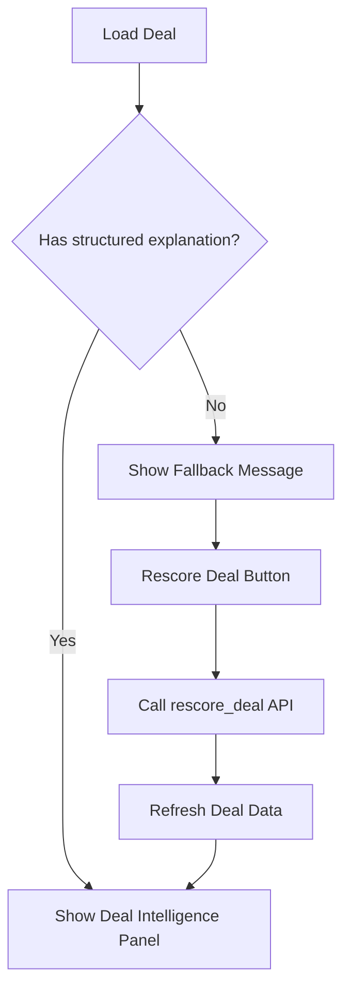

# Deal Explainability Panel UI Fix Plan

## Problem Analysis

The Deal Intelligence panel is not showing in the UI because:

1. **Existing deals have old `probability_breakdown` format**:
   ```json
   // Old format (existing deals)
   {
     "budget_signal": 20,
     "authority_level": 20,
     "need_clarity": 10,
     "timeline_urgency": 8,
     "email_engagement": 15,
     "followup_responsiveness": 10
   }
   ```

2. **New format expected by UI**:
   ```json
   // New format (structured explanation)
   {
     "probability": 65.0,
     "confidence": "Medium",
     "positive_factors": ["Budget signals detected", "Decision maker engaged"],
     "negative_factors": ["Extended timeline"],
     "risk_flags": [],
     "strategic_fit": "SMB opportunity with some positive indicators",
     "recommendation": "REVIEW"
   }
   ```

3. **UI visibility check** - The panel only shows when `'positive_factors' in breakdown`:
   ```python
   has_structured_explanation = isinstance(breakdown, dict) and 'positive_factors' in breakdown
   if has_structured_explanation:
       # Show Deal Intelligence panel
   ```

## Solution

### Option A: Add Fallback UI + Rescore Button (Recommended)

Modify the dashboard to:
1. Show a fallback message when structured explanation is not available
2. Add a "Rescore Deal" button to generate the explanation



### Implementation Steps

#### Step 1: Update Dashboard UI - Add Fallback Section

In `app/multi_agent_dashboard.py`, after the existing Deal Intelligence panel check:

```python
# Deal Intelligence Panel - Structured Explanation
breakdown = deal.get('probability_breakdown', {}) or {}
has_structured_explanation = isinstance(breakdown, dict) and 'positive_factors' in breakdown

if has_structured_explanation:
    # ... existing panel code ...
else:
    # Fallback for deals without structured explanation
    with st.expander("🔎 Deal Intelligence", expanded=False):
        st.info("📊 Structured explanation not available for this deal.")
        st.caption("This deal was scored before the explainability feature was added.")
        
        # Show basic breakdown if available
        if breakdown:
            st.markdown("**Factor Scores (Legacy)**")
            for factor, score in breakdown.items():
                st.write(f"- {factor}: {score}")
        
        # Rescore button
        if st.button("🔄 Rescore Deal", key=f"rescore_{deal_id}"):
            # Call rescore API
            with st.spinner("Rescoring deal..."):
                # This will regenerate the explanation
                success = rescore_deal(deal_id)
                if success:
                    st.success("Deal rescored! Refresh to see updated explanation.")
                    st.rerun()
                else:
                    st.error("Failed to rescore deal.")
```

#### Step 2: Add Rescore Deal Helper Function

Add a helper function in the dashboard to call the rescore API:

```python
def rescore_deal(deal_id: int) -> bool:
    """Rescore a deal to generate structured explanation."""
    from app.services.sales_intelligence_service import SalesIntelligenceService
    from app.database.db import get_db_session
    from app.database.models import Deal, Lead
    
    with get_db_session() as session:
        deal = session.query(Deal).filter(Deal.id == deal_id).first()
        if not deal:
            return False
        lead = session.query(Lead).filter(Lead.id == deal.lead_id).first()
        if not lead:
            return False
    
    service = SalesIntelligenceService()
    result = service.create_or_update_deal(lead, actor="dashboard_rescore")
    return result is not None
```

#### Step 3: Alternative - Use Existing `rescore_deal` Method

The `SalesIntelligenceService` already has a [`rescore_deal()`](app/services/sales_intelligence_service.py:190) method that can be used:

```python
def rescore_deal(self, deal_id: int, actor: str = "manual") -> bool:
    # ... existing implementation ...
```

### Files to Modify

1. **`app/multi_agent_dashboard.py`**:
   - Add fallback UI for deals without structured explanation
   - Add "Rescore Deal" button
   - Add helper function to call rescore API

### Testing

1. Verify fallback UI shows for deals with old format
2. Verify "Rescore Deal" button generates new structured explanation
3. Verify Deal Intelligence panel shows after rescore
4. Verify existing functionality is not broken
