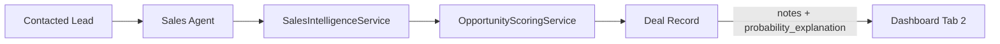

# Deal Qualification Notes Feature Design

## Executive Summary

Enhance the Sales Qualification tab in the dashboard to display both the existing `notes` field AND the `probability_explanation` field, providing users with comprehensive qualification information to make informed decisions.

---

## 1. Current State Analysis

### 1.1 Database Model - Deal Table

**File**: [`app/database/models.py`](app/database/models.py:60)

The Deal model already contains relevant fields:

| Field | Type | Purpose |
|-------|------|---------|
| `notes` | Text | Generic notes field - currently displayed |
| `probability_explanation` | Text | AI-generated qualification reasoning - NOT displayed |
| `probability_breakdown` | JSON | Structured scoring breakdown - NOT displayed |
| `probability_confidence` | Integer | Confidence score - NOT displayed |
| `qualification_score` | Integer | BANT qualification score - displayed |

### 1.2 Current Dashboard Implementation

**File**: [`app/multi_agent_dashboard.py`](app/multi_agent_dashboard.py:160)

Tab 2 - Sales Qualification currently shows:
- Deal ID, Company, Lead ID
- Stage, Deal Value, BANT Score metrics
- Single text area showing only `notes` field (read-only)
- Approve/Reject buttons

### 1.3 Data Flow



### 1.4 Data Population

**File**: [`app/services/sales_intelligence_service.py`](app/services/sales_intelligence_service.py:70)

The `create_or_update_deal()` method populates:
- `qualification_score` from `score.rule_score`
- `probability` from `score.final_probability`
- `probability_explanation` from `score.explanation`
- `probability_breakdown` from `score.breakdown`
- `notes` with phase3 note marker

---

## 2. Gap Analysis

### 2.1 What Exists

| Component | Status | Notes |
|-----------|--------|-------|
| `notes` field in DB | ✅ Exists | Generic text field |
| `probability_explanation` field in DB | ✅ Exists | AI-generated reasoning |
| `probability_breakdown` JSON in DB | ✅ Exists | Structured scoring factors |
| Dashboard shows `notes` | ✅ Works | Single text area |
| Dashboard shows `probability_explanation` | ❌ Missing | Not retrieved or displayed |
| Dashboard shows `probability_breakdown` | ❌ Missing | Not retrieved or displayed |

### 2.2 What is Missing

1. **Dashboard retrieval**: `fetch_pending_deal_reviews()` returns Deal ORM objects but dashboard only accesses `notes`
2. **UI display**: No section to show `probability_explanation` 
3. **Visual distinction**: No separation between system-generated vs user-added notes

---

## 3. Implementation Plan

### 3.1 Overview

This is a **UI-only enhancement** - no database schema changes required. All data already exists; we just need to display it.

### 3.2 Changes Required

#### 3.2.1 Dashboard UI Enhancement

**File**: [`app/multi_agent_dashboard.py`](app/multi_agent_dashboard.py:160)

Modify Tab 2 - Sales Qualification section to:

1. **Add Probability Explanation Section**
   - New text area showing `probability_explanation`
   - Label: "AI Qualification Analysis"
   - Read-only display
   - Height: ~150px

2. **Enhance Existing Notes Section**
   - Keep existing text area
   - Rename label from "Qualification Assessment" to "Additional Notes"
   - Consider making it editable for user input

3. **Add Probability Breakdown Display** (Optional Enhancement)
   - Show structured scoring factors from `probability_breakdown` JSON
   - Display as metrics or bullet points

#### 3.2.2 Data Access

**File**: [`app/database/db_handler.py`](app/database/db_handler.py:236)

The `fetch_pending_deal_reviews()` function already returns complete Deal objects. The ORM-to-DataFrame conversion in [`orm_to_df()`](app/utils/orm.py) should include all fields. Verify that `probability_explanation` is included.

---

## 4. UI Component Design

### 4.1 Enhanced Deal Card Layout

```
┌─────────────────────────────────────────────────────────────────┐
│ Deal #123 - Acme Corp (Lead #456)              🟢 Score: 85/100 │
├─────────────────────────────────────────────────────────────────┤
│ Stage: Qualified    │ Deal Value: $25,000    │ BANT Score: 85/100│
├─────────────────────────────────────────────────────────────────┤
│ ┌─────────────────────────────────────────────────────────────┐ │
│ │ AI Qualification Analysis                                   │ │
│ │ ─────────────────────────────────────────────────────────── │ │
│ │ Strong ICP fit with enterprise company size. Decision maker │ │
│ │ role indicates purchasing authority. Recent tech migration  │ │
│ │ suggests urgency. Growth signals from hiring activity.      │ │
│ │ Probability: 72% | Confidence: High                         │ │
│ └─────────────────────────────────────────────────────────────┘ │
│                                                                 │
│ ┌─────────────────────────────────────────────────────────────┐ │
│ │ Additional Notes                                            │ │
│ │ ─────────────────────────────────────────────────────────── │ │
│ │ [phase3] probability and margin refreshed                   │ │
│ │                                                             │ │
│ │ [Editable text area for user notes]                         │ │
│ └─────────────────────────────────────────────────────────────┘ │
│                                                                 │
│ [✅ Approve Deal]  [❌ Reject Deal]                              │
└─────────────────────────────────────────────────────────────────┘
```

### 4.2 Field Mapping

| UI Element | Database Field | Display Format |
|------------|----------------|----------------|
| Score Badge | `qualification_score` | Number with color coding |
| AI Qualification Analysis | `probability_explanation` | Read-only text area |
| Probability | `probability` | Percentage metric |
| Confidence | `probability_confidence` | Numeric or label |
| Additional Notes | `notes` | Editable text area |

---

## 5. Detailed Implementation Steps

### Step 1: Verify Data Retrieval

Ensure `fetch_pending_deal_reviews()` includes all required fields:

```python
# In app/database/db_handler.py - already returns full Deal objects
def fetch_pending_deal_reviews() -> List[Deal]:
    return session.query(Deal).filter(Deal.review_status == ReviewStatus.PENDING.value).all()
```

### Step 2: Update Dashboard Tab 2

Modify [`app/multi_agent_dashboard.py`](app/multi_agent_dashboard.py:160) around line 200:

```python
# After existing metrics display, add:

# AI Qualification Analysis
probability_explanation = deal.get('probability_explanation', '') or ''
if probability_explanation:
    st.text_area(
        "AI Qualification Analysis",
        value=probability_explanation,
        height=150,
        key=f"ai_analysis_{deal_id}",
        disabled=True
    )

# Probability metrics row
col_p1, col_p2, col_p3 = st.columns(3)
with col_p1:
    prob = deal.get('probability', 0) or 0
    st.metric("Win Probability", f"{prob:.0f}%")
with col_p2:
    confidence = deal.get('probability_confidence', 0) or 0
    st.metric("Confidence", f"{confidence}/100")
with col_p3:
    segment = deal.get('segment_tag', 'N/A') or 'N/A'
    st.metric("Segment", segment)

# Additional Notes (existing, renamed)
notes = deal.get('notes', '') or ''
st.text_area(
    "Additional Notes",
    value=notes,
    height=100,
    key=f"sales_notes_{deal_id}",
    disabled=True  # Or remove disabled=True to make editable
)
```

### Step 3: Handle Empty Data

Add graceful handling for missing `probability_explanation`:

```python
if not probability_explanation:
    st.info("No AI qualification analysis available for this deal.")
```

---

## 6. Testing Considerations

### 6.1 Test Scenarios

1. **Deal with all fields populated**: Verify all sections display correctly
2. **Deal with missing probability_explanation**: Verify graceful fallback
3. **Deal with empty notes**: Verify empty state handling
4. **Deal with long text**: Verify text area scrolling

### 6.2 Existing Tests

Check if tests exist in:
- `tests/unit/services/test_deal_service.py`
- `tests/test_db_handler.py`

---

## 7. Migration Notes

**No database migration required** - all fields already exist in the schema.

---

## 8. Future Enhancements (Out of Scope)

1. **Editable Notes**: Allow users to add notes before approval
2. **Probability Breakdown Visualization**: Show scoring factors as charts
3. **Historical Notes**: Track note changes over time
4. **Note Templates**: Pre-defined note templates for common scenarios

---

## 9. Summary

| Aspect | Details |
|--------|---------|
| **Scope** | UI enhancement only |
| **Files Changed** | `app/multi_agent_dashboard.py` |
| **Database Changes** | None required |
| **API Changes** | None required |
| **Risk Level** | Low - display-only change |
