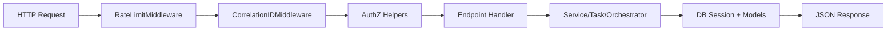
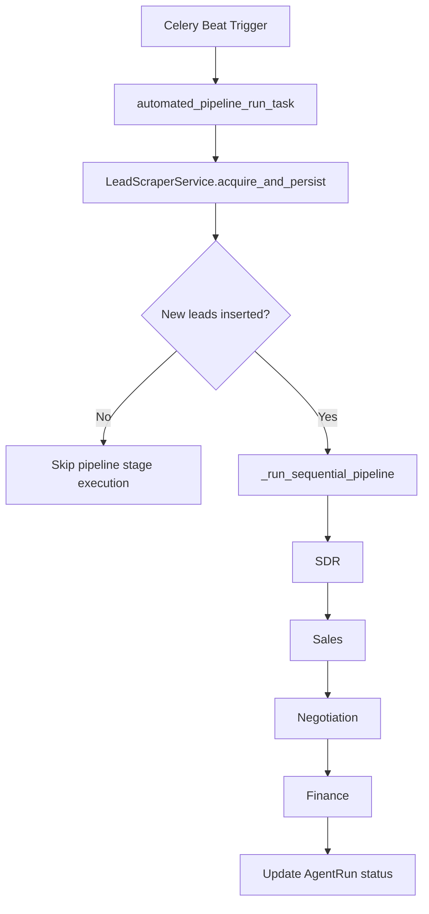
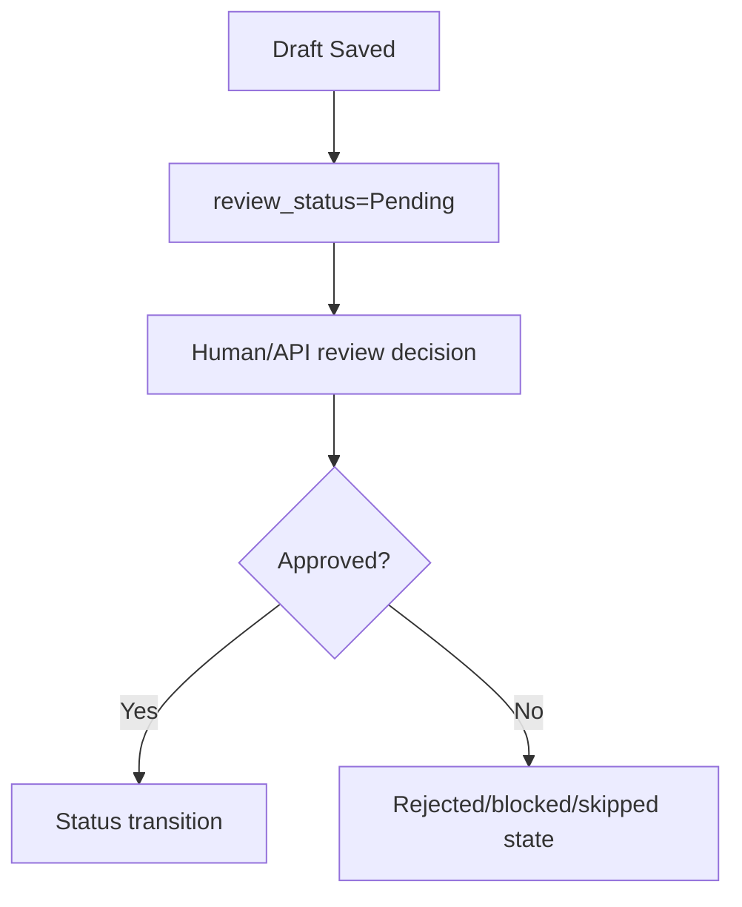

# SYSTEM ARCHITECTURE

## Simple Explanation
Think of RIVO as a pipeline controller with four worker stages and a shared database.
- API endpoints accept commands and queries.
- Services and agents do business work.
- Database tables store stage state and review decisions.
- Scheduler/Celery runs the same pipeline automatically.

The key design rule is that generation can be automated, but progression is review-gated.

## Technical Explanation

### Layered Runtime Architecture
`API -> Services/Agents -> Database`

- API layer:
  - App bootstrap and middleware: `app/main.py:18`
  - Mounted v1 router: `app/api/v1/router.py:9`
  - Main runtime routes: `app/api/v1/endpoints.py:59`
- Agent/service layer:
  - Stage agents: `app/agents/*.py`
  - Business services: `app/services/*.py`
- Data layer:
  - Session management: `app/database/db.py:73`
  - State handlers: `app/database/db_handler.py:53`
  - ORM schema: `app/database/models.py:24`

### Request Lifecycle (API-triggered)

Key references:
- Rate limit middleware dispatch: `app/middleware/rate_limit.py:204`
- Correlation middleware dispatch: `app/middleware/correlation.py:107`
- Auth scope gate: `app/api/v1/_authz.py:20`
- Endpoint route handlers: `app/api/v1/endpoints.py:59`

### Task Lifecycle (Scheduler-triggered)

Key references:
- Scheduler root task: `app/tasks/scheduler.py:193`
- Sequential runner: `app/tasks/scheduler.py:98`
- Agent execution wrapper: `app/tasks/agent_tasks.py:147`

### Review-Gate Transition Architecture

Concrete transition authorities:
- Lead transition on approval: `mark_review_decision()` in `app/database/db_handler.py:129`
- Contract transition on approval: `mark_contract_decision()` in `app/database/db_handler.py:351`
- Invoice dunning progression on approval: `mark_dunning_decision()` in `app/database/db_handler.py:488`

### Mounted vs Non-mounted v1 Route Modules
Mounted in runtime router:
- `app/api/v1/endpoints.py`
- `app/api/v1/auth.py`

Present but not mounted by `app/api/v1/router.py:10-11`:
- `app/api/v1/agents.py`
- `app/api/v1/runs.py`
- `app/api/v1/reviews.py`
- `app/api/v1/prompts.py`
- `app/api/v1/health.py`

### Key Design Decisions Visible in Code
1. **Explicit queue handoff from API**
   - `execute_agent_task.delay(...)` used in `app/api/v1/endpoints.py:71`
2. **Sequential scheduler execution with failure stop**
   - `_run_sequential_pipeline()` in `app/tasks/scheduler.py:98`
3. **Human review gate semantics in persistence layer**
   - `save_draft()` intentionally does not move lead status (`app/database/db_handler.py:94`)
4. **Fallback-first resilience**
   - DB fallback: `app/database/db.py:103`
   - LLM failure returns empty string contract: `app/services/llm_client.py:29`
   - Celery fallback implementation if package missing: `app/tasks/celery_app.py:11`
