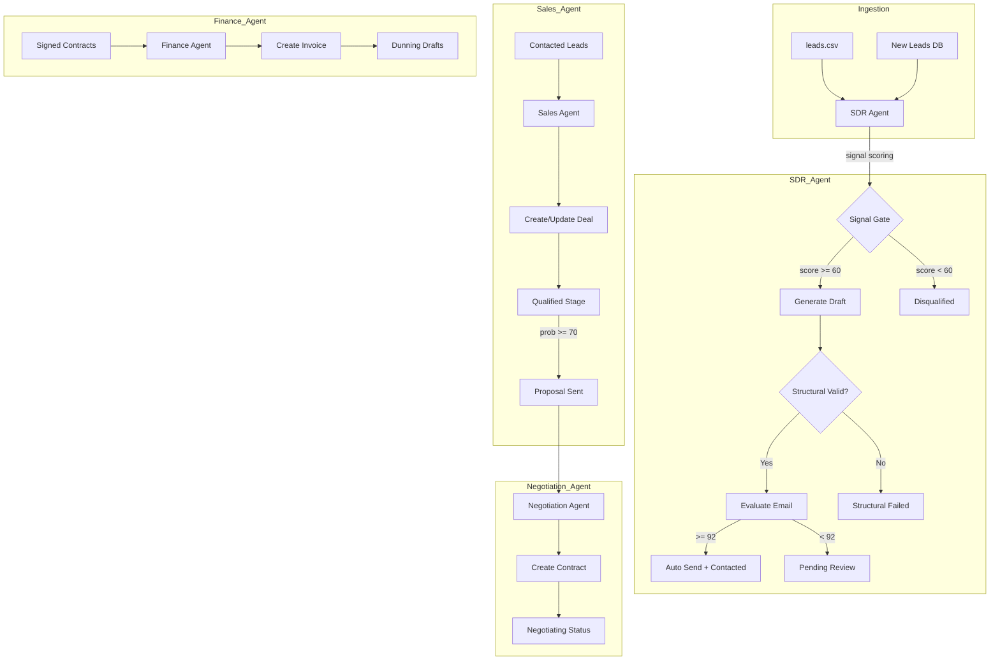
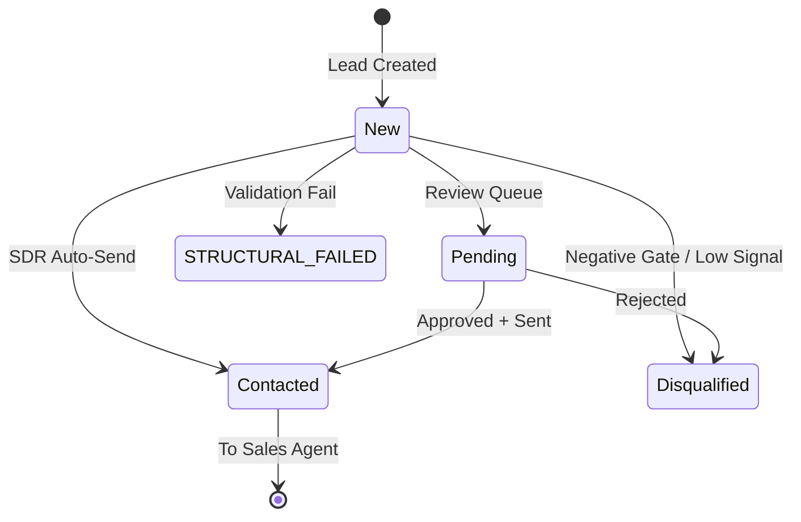
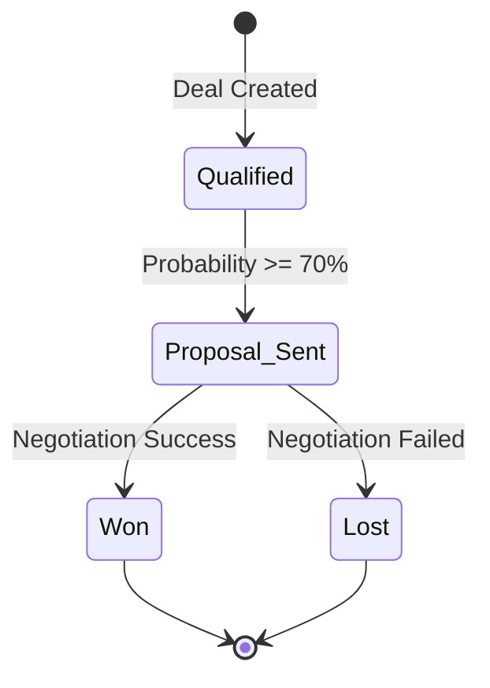

# RIVO System Stabilization & Finalization Plan

## Executive Summary

This plan addresses the stabilization and finalization of the RIVO 4-agent revenue system, plus the addition of scraping-based lead ingestion for the SDR agent. The scope is strictly limited to fixing bugs, eliminating inconsistencies, and hardening existing functionality—no new features or business logic.

---

## Current Architecture Analysis

### System Flow Diagram



---

## PART 1: Scraping-Based Lead Ingestion for SDR

### Design Requirements

1. **Modular Architecture**: Separate scraper service that does NOT call LLM
2. **Scheduler-Triggered**: Not auto-continuous, must be invoked
3. **Safe Failure**: Errors logged, no CSV corruption, no orchestrator crash
4. **Deduplication**: By email + company before insertion
5. **Schema Validation**: Before insertion
6. **Status Assignment**: Only "New" status leads

### File Structure

```text
app/
|-- services/
|   `-- lead_scraper.py      # Core scraper module
|-- tasks/
|   `-- scheduler.py         # Scheduler entrypoint (supersedes old app/workers wrapper)
`-- config/
    `-- scraper_sources.py   # Source configurations
```

### Function Contracts

```python
# app/services/lead_scraper.py

def scrape_sources(source_configs: list[dict]) -> list[dict]:
    """Fetch raw data from configured sources. Returns raw records."""
    pass

def normalize_lead(raw_record: dict) -> dict:
    """Transform raw record to canonical lead schema."""
    pass

def validate_lead_schema(lead_dict: dict) -> tuple[bool, str]:
    """Validate required fields. Returns (is_valid, error_message)."""
    pass

def deduplicate_against_csv(lead_dict: dict, csv_path: str) -> bool:
    """Check if lead exists by email + company. Returns True if duplicate."""
    pass

def insert_new_leads(leads: list[dict], csv_path: str = "db/leads.csv") -> int:
    """Insert validated, deduplicated leads. Returns count inserted."""
    pass

def run_scraper_job(source_configs: list[dict] | None = None) -> dict:
    """Main entry point. Returns summary dict with counts and errors."""
    pass
```

### Schema Requirements

| Field | Required | Validation |
|-------|----------|------------|
| name | Yes | Non-empty string |
| email | Yes | Valid email format |
| company | Yes | Non-empty string |
| role | No | String |
| industry | No | String |
| company_size | No | String |
| website | No | URL format |
| location | No | String |
| verified_insight | No | Text |
| source | Auto | Set to "scraper" |

### Safety Mechanisms

1. **Atomic Writes**: Write to temp file, then rename
2. **Error Isolation**: Single source failure does not abort other sources
3. **Logging**: All operations logged with correlation IDs
4. **Rate Limiting**: Respect source-specific rate limits
5. **Timeout Protection**: Per-source timeout limits

---

## PART 2: Agent Finalization

### 2.1 SDR Agent Fixes

#### Issues Identified

| Issue | Location | Fix |
|-------|----------|-----|
| Threshold inconsistency | Line 31-32 | `APPROVAL_THRESHOLD = 85` but auto-send at 92. Clarify: approval for review queue, auto-send for immediate send |
| Signature injection | Line 162-170 | Single canonical injection, no duplicate logic |
| Confidence parsing | Line 196-198 | Safe parsing with default 0 on malformed JSON |
| State transitions | Line 217-277 | Verify all paths are deterministic |

#### Required Changes

```python
# Constants - clarify purpose
REVIEW_QUEUE_THRESHOLD = 85  # Minimum score to enter review queue
AUTO_SEND_THRESHOLD = 92     # Score for immediate send (no review)
SIGNAL_THRESHOLD = 60        # Minimum signal score to proceed

# State transitions - must be deterministic
# New -> Contacted (auto-send success)
# New -> Disqualified (negative gate OR low signal)
# New -> Pending Review (score < AUTO_SEND but >= REVIEW_QUEUE)
# New -> Structural Failed (validation failure)
# New -> Blocked (negative gate)
```

#### Validation: No Duplicate Signature Injection

Current code at [`inject_signature()`](app/agents/sdr_agent.py:162) is called once per email. Verify no other signature logic exists.

### 2.2 Sales Agent Fixes

#### Issues Identified

| Issue | Location | Fix |
|-------|----------|-----|
| Stage capitalization | Line 49-52 | Uses "Lead", "Qualified", "Proposal Sent" - must match DealStage enum |
| Field name inconsistency | Model vs Service | Model has `deal_value` and `acv` - service uses both |
| Missing validation | Line 35 | No check if lead is actually Contacted |
| Duplicate deal creation | Line 77-87 | Has check, but needs idempotency guarantee |

#### Required Changes

1. **Stage Name Synchronization**

```python
# Current DealStage enum values (app/core/enums.py)
QUALIFIED = "Qualified"
PROPOSAL_SENT = "Proposal Sent"
WON = "Won"
LOST = "Lost"

# Sales Intelligence Service uses different stages (app/services/sales_intelligence_service.py)
PIPELINE_STAGES = ["Lead", "Qualified", "Proposal Sent", "Negotiation", "Closed Won", "Closed Lost"]

# RESOLUTION: Align all stage names to DealStage enum
# Remove "Lead" stage - deals start at "Qualified" when created from Contacted leads
# "Negotiation" -> handled by Negotiation Agent
# "Closed Won"/"Closed Lost" -> "Won"/"Lost" per enum
```

2. **Field Name Standardization**

```python
# Model has both deal_value and acv
# Standardize: acv = Annual Contract Value (authoritative)
# deal_value = total deal value (may differ from acv for multi-year)
# Service should set both consistently
```

3. **Validation Before Deal Creation**

```python
def create_or_update_deal(self, lead: Lead, actor: str = "sales_agent") -> Deal | None:
    # Add guard clause
    if lead.status != LeadStatus.CONTACTED.value:
        logger.warning("sales.lead_not_contacted", extra={"lead_id": lead.id, "status": lead.status})
        return None
    # ... rest of logic
```

### 2.3 Negotiation Agent Fixes

#### Issues Identified

| Issue | Location | Fix |
|-------|----------|-----|
| Contract idempotency | Line 123-128 | Has check via `create_contract()` but needs stronger guarantee |
| No loop safety | N/A | War-room simulation not implemented, but add max turns guard |
| Confidence parsing | Line 82-88 | Safe parsing exists, verify |
| Stage transition | N/A | No deal stage update after negotiation |

#### Required Changes

1. **Contract Creation Idempotency**

```python
# create_contract() in db_handler.py already checks for existing contract
# Add logging for idempotent returns
if existing:
    logger.info("contract.exists", extra={"deal_id": deal_id, "contract_id": existing.id})
    return existing.id
```

2. **Max Turns Guard** (for future war-room simulation)

```python
MAX_NEGOTIATION_TURNS = 3

def simulate_negotiation_turn(current_turn: int, ...):
    if current_turn >= MAX_NEGOTIATION_TURNS:
        return "max_turns_reached"
    # ... simulation logic
```

3. **No Overwriting Signed Contracts**

```python
def create_contract(...):
    # Add check for existing SIGNED contract
    existing = session.query(Contract).filter(Contract.deal_id == deal_id).first()
    if existing:
        if existing.status == ContractStatus.SIGNED.value:
            logger.warning("contract.already_signed", extra={"deal_id": deal_id})
            return existing.id  # Do not modify
        return existing.id
```

### 2.4 Finance Agent Fixes

#### Issues Identified

| Issue | Location | Fix |
|-------|----------|-----|
| Duplicate invoices | Line 146-151 | Check exists, verify it works |
| Due date parsing | Line 44-53 | Has error handling, verify |
| Days overdue calculation | Line 40-53 | Verify date arithmetic |
| Dunning draft storage | Line 196 | Uses `save_dunning_draft()` - verify field name |

#### Required Changes

1. **Invoice Deduplication Verification**

```python
# Current code at line 146-151
existing_contract_ids = {inv.contract_id for inv in all_invoices}
if contract_id in existing_contract_ids:
    continue  # Correct - skip duplicate
```

2. **Dunning Draft Field Standardization**

```python
# Verify save_dunning_draft() uses draft_message field
# Should match SDR pattern: draft_message for AI-generated content
```

3. **Date Arithmetic Safety**

```python
def calculate_days_overdue(due_date_obj) -> int:
    # Current implementation handles string, datetime, date
    # Add explicit timezone handling if needed
    # Ensure consistent UTC usage
```

---

## PART 3: System-Wide Synchronization

### Canonical Field Names

| Entity | Field | Type | Purpose |
|--------|-------|------|---------|
| Lead | draft_message | Text | AI-generated email draft |
| Lead | confidence_score | Integer | SDR confidence in draft |
| Lead | signal_score | Integer | Lead quality signal |
| Lead | review_status | String | Review state |
| Deal | stage | String | Pipeline stage (use DealStage enum) |
| Deal | acv | Integer | Annual Contract Value |
| Deal | deal_value | Integer | Total deal value |
| Deal | probability | Float | Win probability 0-100 |
| Deal | review_status | String | Review state |
| Contract | status | String | Contract status (use ContractStatus enum) |
| Contract | review_status | String | Review state |
| Invoice | status | String | Invoice status (use InvoiceStatus enum) |
| Invoice | draft_message | Text | Dunning email draft |

### Enum Synchronization

```python
# app/core/enums.py - AUTHORITATIVE SOURCE

class LeadStatus(Enum):
    NEW = "New"
    CONTACTED = "Contacted"
    QUALIFIED = "Qualified"
    DISQUALIFIED = "Disqualified"

class DealStage(Enum):
    QUALIFIED = "Qualified"
    PROPOSAL_SENT = "Proposal Sent"
    WON = "Won"
    LOST = "Lost"

class ContractStatus(Enum):
    NEGOTIATING = "Negotiating"
    SIGNED = "Signed"
    COMPLETED = "Completed"
    CANCELLED = "Cancelled"

class InvoiceStatus(Enum):
    SENT = "Sent"
    PAID = "Paid"
    OVERDUE = "Overdue"

class ReviewStatus(Enum):
    NEW = "New"
    PENDING = "Pending"
    APPROVED = "Approved"
    REJECTED = "Rejected"
    AUTO_APPROVED = "Auto-Approved"
    STRUCTURAL_FAILED = "STRUCTURAL_FAILED"
    BLOCKED = "BLOCKED"
    SKIPPED = "SKIPPED"
```

### Validator Consolidation

Single source of truth: [`app/utils/validators.py`](app/utils/validators.py)

- `validate_structure()` - Email structural validation
- `deterministic_email_quality_score()` - Quality scoring
- `sanitize_text()` - Text sanitization
- `contains_forbidden_tokens()` - Placeholder detection

No duplicate validation logic in agents.

---

## PART 4: LLM Client Hardening

### Current Implementation Analysis

[`app/services/llm_client.py`](app/services/llm_client.py)

#### Issues

1. **Retry Logic**: Lines 42-77 - Has retry with fast-fail for local Ollama
2. **JSON Parsing**: Not in llm_client.py - handled in callers
3. **Fallback**: Returns empty string on failure

#### Required Hardening

```python
def call_llm(prompt: str, json_mode: bool = False) -> str:
    """
    Call LLM with retry logic and safe fallback.
    
    Returns:
        str: LLM response or empty string on failure (never None, never raises)
    """
    # Current implementation is correct
    # Add explicit documentation that return is never None
    # Ensure all callers handle empty string gracefully
```

#### JSON Parsing Standardization

Create helper in `app/core/schemas.py`:

```python
def safe_parse_json(response: str, schema: type, default: Any = None) -> Any:
    """
    Safely parse JSON response into schema.
    Returns default on any parsing failure.
    Never raises exception.
    """
    if not response or not response.strip():
        return default
    try:
        data = json.loads(response)
        return parse_schema(schema, response)
    except (json.JSONDecodeError, ValueError, TypeError):
        return default
```

---

## PART 5: Final Architecture Documentation

### Updated System Flow

```mermaid
flowchart LR
    subgraph Ingestion
        SCRAPER[Lead Scraper] --> CSV[leads.csv]
        CSV --> DB[(Database)]
        MANUAL[Manual Entry] --> DB
    end
    
    subgraph SDR
        DB --> |status=New| SDR_AGENT[SDR Agent]
        SDR_AGENT --> |signal >= 60| DRAFT[Generate Draft]
        SDR_AGENT --> |signal < 60| DISQ[Disqualified]
        DRAFT --> |valid| REVIEW[Review Queue]
        DRAFT --> |invalid| STRUCT[Structural Failed]
        REVIEW --> |score >= 92| CONTACTED[Contacted]
        REVIEW --> |score < 92| PENDING[Pending Review]
    end
    
    subgraph Sales
        CONTACTED --> |status=Contacted| SALES_AGENT[Sales Agent]
        SALES_AGENT --> |create deal| QUALIFIED[Qualified]
        QUALIFIED --> |prob >= 70| PROP_SENT[Proposal Sent]
    end
    
    subgraph Negotiation
        PROP_SENT --> |stage=Proposal Sent| NEG_AGENT[Negotiation Agent]
        NEG_AGENT --> |create contract| NEGOTIATING[Negotiating]
        NEGOTIATING --> |approved| SIGNED[Signed]
    end
    
    subgraph Finance
        SIGNED --> |status=Signed| FIN_AGENT[Finance Agent]
        FIN_AGENT --> |create invoice| INVOICE[Invoice Sent]
        INVOICE --> |overdue| DUNNING[Dunning Drafts]
    end
```



### Entity State Machines





---

## Implementation Checklist

### Phase 1: Scraping Module
- [ ] Create `app/services/lead_scraper.py`
- [x] Use `app/tasks/scheduler.py` (superseded old `app/workers/scheduler.py` wrapper)
- [ ] Create `app/config/scraper_sources.py`
- [ ] Add deduplication logic
- [ ] Add schema validation
- [ ] Add error handling and logging
- [ ] Write unit tests

### Phase 2: SDR Agent Finalization
- [ ] Clarify threshold constants
- [ ] Verify single signature injection
- [ ] Add confidence parsing safety
- [ ] Verify state transitions
- [ ] Write unit tests

### Phase 3: Sales Agent Finalization
- [ ] Align stage names with DealStage enum
- [ ] Standardize field names (acv vs deal_value)
- [ ] Add lead status validation
- [ ] Verify deal creation idempotency
- [ ] Write unit tests

### Phase 4: Negotiation Agent Finalization
- [ ] Add signed contract protection
- [ ] Add max turns guard
- [ ] Verify contract idempotency
- [ ] Write unit tests

### Phase 5: Finance Agent Finalization
- [ ] Verify invoice deduplication
- [ ] Verify dunning draft field
- [ ] Add date arithmetic safety
- [ ] Write unit tests

### Phase 6: System Synchronization
- [ ] Audit all enum usages
- [ ] Audit all field names
- [ ] Remove duplicate validators
- [ ] Update documentation

### Phase 7: LLM Client Hardening
- [ ] Add safe JSON parsing helper
- [ ] Document empty string return behavior
- [ ] Verify all callers handle empty string

### Phase 8: Final Testing
- [ ] Run full test suite
- [ ] Integration tests
- [ ] Manual pipeline verification
- [ ] Update AGENTS.md

---

## Bug Fixes Summary

| ID | Component | Issue | Fix |
|----|-----------|-------|-----|
| BUG-001 | Sales | Stage name mismatch with enum | Align to DealStage enum values |
| BUG-002 | Sales | No lead status check | Add guard clause for Contacted status |
| BUG-003 | Negotiation | Potential contract overwrite | Add signed contract check |
| BUG-004 | All | Inconsistent field names | Standardize to canonical names |
| BUG-005 | LLM | JSON parsing in multiple places | Consolidate to safe_parse_json |

---

## Safety Mechanisms Added

1. **Scraping**: Atomic writes, error isolation, timeout protection
2. **SDR**: Deterministic state transitions, safe confidence parsing
3. **Sales**: Lead status validation, idempotent deal creation
4. **Negotiation**: Signed contract protection, max turns guard
5. **Finance**: Invoice deduplication, safe date parsing
6. **LLM**: Safe JSON parsing, never-throw contract

---

## Idempotency Guarantees

| Operation | Idempotency Key | Behavior on Duplicate |
|-----------|-----------------|----------------------|
| Lead insertion | email + company | Skip with log |
| Deal creation | lead_id | Update existing |
| Contract creation | deal_id | Return existing ID |
| Invoice creation | contract_id | Skip with log |
| Email send | lead_id + timestamp | Checked by EmailService |

---

## Final System Summary

The RIVO system will be:

- **Clean**: No duplicate code, consolidated validators
- **Stable**: All error paths handled, safe fallbacks
- **Deterministic**: State transitions are explicit and predictable
- **Idempotent**: All creation operations have idempotency keys
- **Production-safe**: No crash paths, graceful degradation
- **Synchronized**: Single source of truth for enums and field names

Total scope: 4 agents stabilized, 1 scraping module added, 0 new features.


